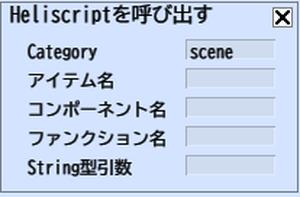

# Heliscriptを呼び出す



アクションからHeliScriptを呼び出す際に使用します。

引数にはコンポーネント名・メソッド名・引数をを指定します。

例えば、

```csharp
component Foo {

void Method(string Param)

}
```

を呼び出したい場合は、”Foo,Method,abc”などと指定すると、Paramに”abc”が代入された状態でMethodが呼び出されます。

| フィールド | 初期値 |  機能  |
| ---- | ---- | ---- |
| Name || 設置アイテム一覧に配置されているアイテムを名前で指定します。 |
| Category | scene | Item名、またはレイヤー名を指定します。 |
| アイテム名 | scene | 呼び出し対象のコンポーネントの所属カテゴリーを指定します。基本的にはsceneのままで使用します。 |
| コンポーネント名 | scene | コンポーネント名を設定してください。 |
| ファンクション名 | | メソッド名を指定してください。 |
| String型引数 | | 引数を設定してください。 |
