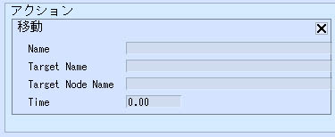

# MoveTo

移動は、指定したアイテムをターゲットとして設定したアイテムのノードの位置まで線形移動させます。

| 名称 | 機能 |
| ---- | ---- |
| Name | 移動させたいアイテムをハイアラキ上の名前で指定します。|
| Target Name | 移動目標となるノードが含まれたアイテムをハイアラキ上の名前で指定します。 |
| Target Node Name | 移動目標となるノードの名前を指定します。 |
| Time | 移動にかかる秒数を設定します。 |
