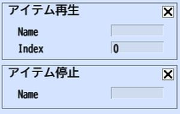

# アイテム再生/停止

## 概要

アイテム再生は、音声を再生します。

音声を再生するには、ワールドに音声を追加する必要があります。

※アバターアニメーションの再生については[モーション](../Motion/Motion.md)をご参照ください。

## StopItemについて

アイテム停止は、音声を停止します。

!!! warning 音声の再生について
    現バージョンでは、World Builder上で音声を再生することはできます。
    ワールドをアップロードすることで、音声を再生することができます