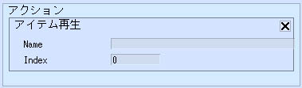
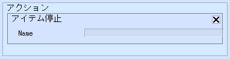

# アイテム再生/停止

アイテム再生は、指定したアイテムのサウンド・アニメーションを再生します。

アイテム停止は、逆に再生を停止します。

| 名称 | 機能 |
| ---- | ---- |
| Name | 再生させたいアイテムのハイアラキ上の名前を指定します。|
| Index | アニメーションを再生する際に、指定したIndex番号のアニメーションを再生します。 |

!!! warning "アニメーションについて"
    αテスト時点ではアバター未対応のため、アニメーションの再生は対応しておりません。

!!! warning "アイテム停止について"
    αテスト時点ではアイテム停止は使用できません。
