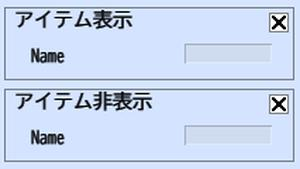

# Show/Hide Item

Show/Hide Item lets you display/hide GameObjects marked as "Items".
The term "item" here refers to an object that is displayed as a box icon in the list panel within the World Builder, which can be placed in the environment.

If you wish to display/hide Objects inside of a .heo file, Check [Show/HideNode](../Node/ShowHideNode.md).
