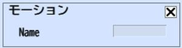

# モーション

モーションは、アバターに設定されたモーションを再生します。Motion Nameには、モーション名を指定します。

|  ラベル |  機能  |
| ----   | ---- |
| Motion Name | 再生するモーション名を設定してください。 |

!!! warning "注意"
    現バージョンでは、World Builderでモーションを追加することはできません