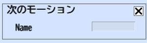

# ネクストモーション

ネクストモーションは、モーションアクションで再生されたモーションの再生完了後に再生するモーションを設定できます。なお、この設定は一つのアクションリストで、複数指定することは出来ません。

Motion Nameには、モーション名を指定します。

|  ラベル |  機能  |
| ----   | ---- |
| Name | 変数名を自由に設定してください。 |

!!! warning "注意"
    現バージョンでは、World Builderでモーションを追加することはできません
