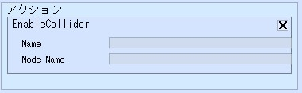
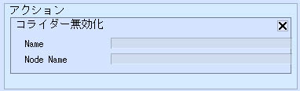

# Enable/DisableCollider

Enable/DisableColliderは、アイテムを構成するノードに含まれるコライダーの無効化・有効化をコントロールします。

| 名称 | 機能 |
| ---- | ---- |
| Name | コライダーを切り替えたいノードが含まれるアイテムのハイラルキ上の名前を入力します |
| Node Name | アイテムに紐づいているノードの名前を記入します |
