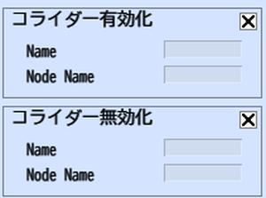

# コライダー有効化/無効化

!!! warning コライダー有効化/無効化について
    現バージョンでは、World Builder上でこのアクションを実行することができません。
    ワールドをアップロードすることで、アクションを実行することができます。

コライダー有効化/無効化は、アイテムを構成するノードに含まれるコライダーの無効化・有効化をコントロールします。

| 名称 | 機能 |
| ---- | ---- |
| Name | コライダーを切り替えたいノードが含まれるアイテムの設置アイテム一覧パネル上の名前を入力します |
| Node Name | アイテムに紐づいているノードの名前を記入します |
