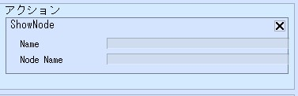
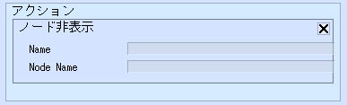

# Show/HideNode

ノード表示やノード非表示は、アイテムを構成するノードのメッシュの表示・非表示をコントロールすることができます。

| 名称 | 機能 |
| ---- | ---- |
| Name | メッシュ表示を切り替えたいノードが含まれるアイテムの設置アイテム一覧パネル上の名前を入力します |
| Node Name | アイテムに紐づいているノードの名前を記入します |
