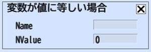

# If Variable Equal To Value

If a designated Name(Variable) equals to NValue(integer), the Actions that follow will be discarded.

The variable defined at [Set Var](SetVar.md) is applicable.

Addition to the variable can be done by using [Add Var](AddVar.md).

| Label | Function |
| ---- | ---- |
| Name | Specify the variable name being compared. |
| NValue | Set the comparing integer value. |
