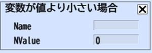

# 変数が値より小さい場合

変数が値より小さい場合では、比較対象とするName(変数)がNValue(値)より小さい場合、以降のアクションを実行せずに終了します。

変数は[変数の設定](SetVar.md)にて定義したものが指定できます。

変数の加算は[変数を加算](AddVar.md)で行う事が出来ます。

| 名称 | 機能  |
| ---- | ---- |
| Name | 比較対象とする変数名を指定してください。 |
| NValue | 比較する整数値を設定してください。 |
