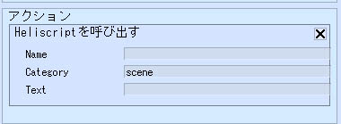

# Heliscriptを呼び出す



ActionsからHeliScriptを呼び出す際に使用します。

引数にはコンポーネント名・メソッド名・引数をカンマ区切りで指定します。

例えば、

```csharp
component Foo {

void Method(string Param)

}
```

を呼び出したい場合は、”Foo,Method,abc”などと指定すると、Paramに”abc”が代入された状態でMethodが呼び出されます。

| フィールド | 初期値 |  機能  |
| ---- | ---- | ---- |
| Name || 設置アイテム一覧に配置されているアイテムを名前で指定します。 |
| Category | scene | 呼び出し対象のコンポーネントの所属カテゴリーを指定します。基本的にはsceneのままで使用します。 |
| Text | | 呼び出し対象のコンポーネントやメソッド名、引数をまとめてカンマ区切りで記述します。「コンポーネント名,メソッド名,文字列引数」の順番で記述します。 |
