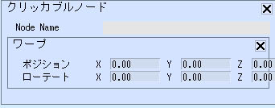

# Warp

ワープアクションは、プレイヤーを指定の座標・向きに瞬間移動させます。

| 名称 |  機能  |
| ----   | ---- |
| ポジション | ワープ目標となる座標を指定します |
| ローテート | ワープ後のプレイヤーの向きを指定します |

!!! Caution "注意点"
    - 向きが適用されるのはY方向のみです。
    - アバターは移動後に重力によって落下する場合があります。
