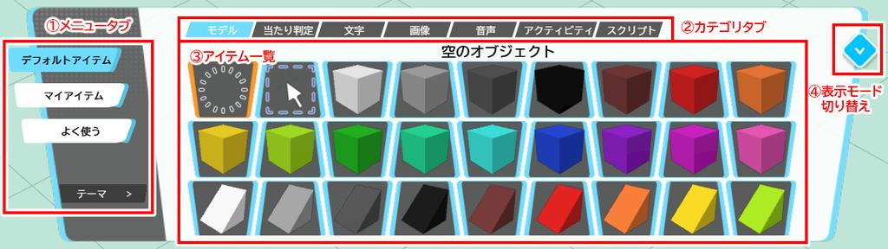
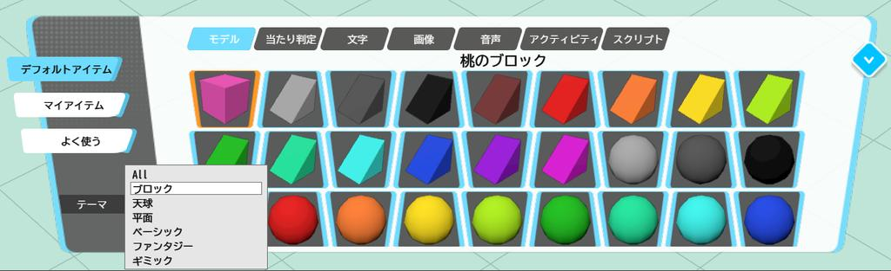
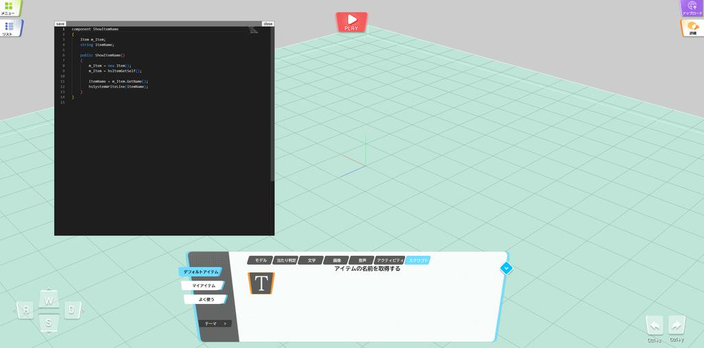
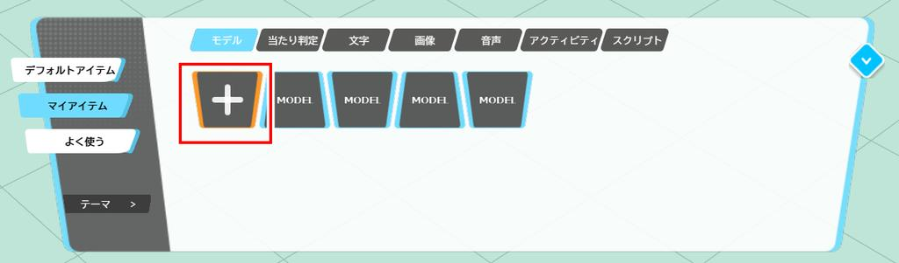
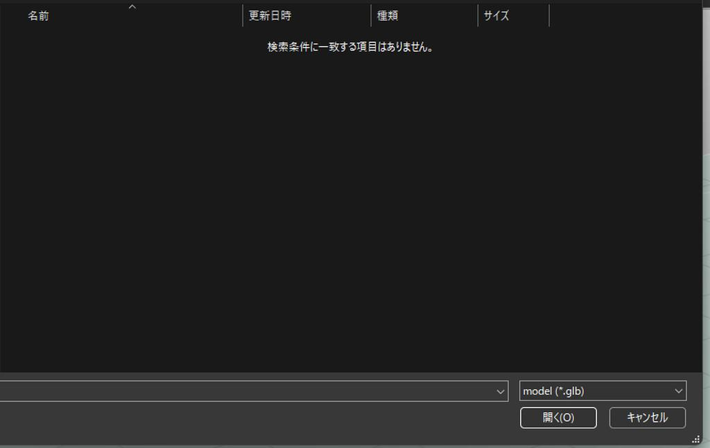
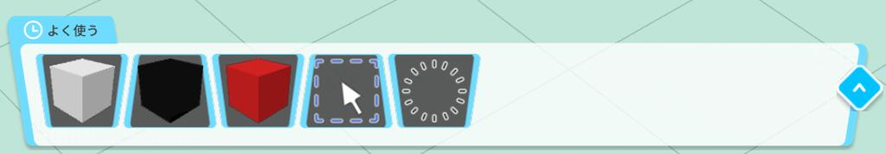

# アイテムパネルの操作方法

## アイテムパネル

アイテムパネルでは、ワールド上に配置できる各タイプのアイテムの設定と、そのワールドで利用できるスクリプトの表示と設定が行えます。

### ①メニュータブ

| 項目名 | 詳細 |
|----|----|
| デフォルトアイテム | 配布されているデフォルトアイテムが表示されます。 |
| マイアイテム | 自分でアップロードしたアイテムが表示されます。 |
| よく使う | 直近で使ったアイテムが表示されます。 |
| テーマ | デフォルトアイテム選択時、テーマに沿ったアイテムのみをフィルターして表示することができます。 |

### ②カテゴリタブ

| 項目名 | 詳細 |
|----|----|
| モデル | シーン上に配置することで、3Dモデルが表示されるタイプのアイテムが表示されます。対応拡張子：heo、glb |
| 当たり判定 | シーン上に配置することで、キャラクターがぶつかるコライダー（透明の壁）や、ギミックの発火に利用できるエリアコライダーといったタイプのアイテムが表示されます。 |
| 文字 | シーン上に配置することで、ワールド上で編集できるテキストを追加することができるアイテムが表示されます。 |
| 画像 | シーン上に配置することで、一枚の画像として表示できるタイプのアイテムが表示されます。対応拡張子：jpg, pngなどの画像ファイル |
| 音声 | シーン上に配置することで、BGMやSEとして再生できるアイテムが表示されます。（シーンビルダー上では現時点ではプレビューできません）対応拡張子：mp3 |
| アクティビティ | シーン上に配置することで、アクティビティタイプのアイテムが表示されます。対応拡張子：json |
| スクリプト | HeliScriptという、ワールドで利用できるプログラムが一覧として表示されます。モデルとして追加したアイテムにスクリプトとしての追加や、アクションのHeliScriptを呼び出すことで使用できます。対応拡張子：hs |

#### スクリプトの編集
スクリプトタブをダブルクリックすることで、スクリプトを編集することができるエディターを開くことができます。

### ③アイテム一覧
ワールド上に配置することができる、アイテムが一覧で表示されます。
マイアイテムのアイテム追加ボタンから追加した、アイテムを右クリックすることで、アイテムの編集を行うことができます。

| 名称 | 機能  |
| ----   | ---- |
| アセットを変更 | 登録したアイテムのファイルを更新します。更新したアイテムはWorld Builderを再読み込みすることで反映されます。 |
| アセットの名前を変更 | 登録したアイテムの名称を変更します |
| アセットを削除 | 登録したアイテムを削除します。　削除したアイテムのURLは失効しないためすでにアップロードしたアイテムは残り続けます |

#### アイテム追加ボタン
アイテムをアップロードするには、アイテムパネルのマイアイテムから、各アイテムのタイプごとのタブを選択し、プラスボタンを押すことでアップロードすることができます。

プラスボタンを押すことで、ファイルを選択するためのウィンドウが開きます。

アップロードが完了すると、アイテムが各タブに追加されます。

### ④表示モード切替
ボタンをクリックすることで、よく使うメニューのみ表示されたアイテムパネルが縮小モードとして表示されます。

