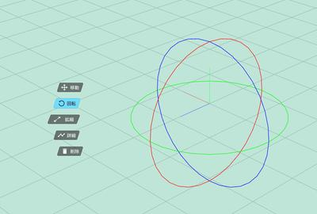

# マニピュレーターの操作方法

## 操作方法

| ボタン | 挙動 |
|---|---|
| ツールバー＞移動ボタン | 移動マニピュレーターを表示。 |
| ツールバー＞回転ボタン | 回転マニピュレーターを表示。 |
| ツールバー＞拡縮ボタン | 拡縮マニピュレーターを表示。 |

## 移動マニピュレーター

- マウスオーバーで選択しようとしている軸、もしくは面が黄色くハイライトされます。

- 軸を選択することで、軸に対しての一次元的な移動を行います。

- 面を選択することで、面に対して二次元的な移動を行います。

## 回転マニピュレーター

- マウスオーバーで選択しようとしている円が黄色くハイライトされます。

- 円を選択することで、円の軸に対して回転を行います。

## 拡縮マニピュレーター

- マウスオーバーで選択しようとしている軸が黄色くハイライトされます。

- 円を選択することで、円の軸に対してサイズ変更を行います。

- グレーの部分を選択することで、X, Y, Z全体が大きくなります。
