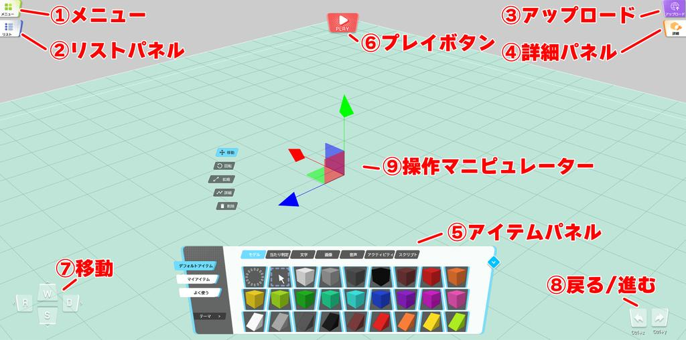
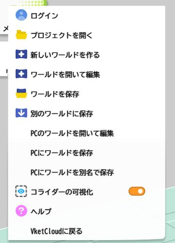
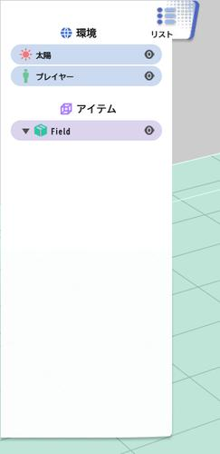
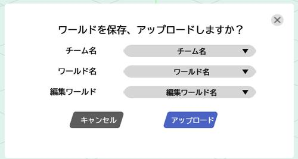
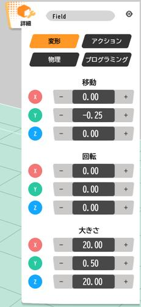
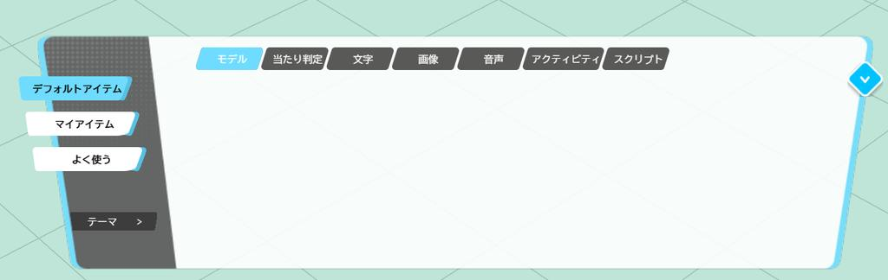
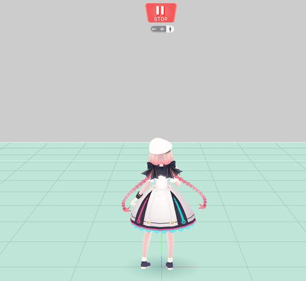
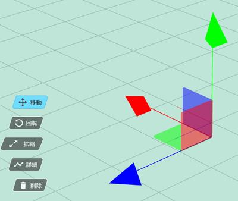

# 各ウィンドウの機能

## メインウィンドウ

実際にオブジェクトを置いたり、置いたオブジェクトを編集したり、プレビュー時に歩き回れるワールドとなる画面です。

オブジェクトの編集に使用するマニピュレーターの操作については、

[マニピュレーターの操作方法](./Manipulator.md)

カメラの操作については、

[カメラの操作方法](./CameraControls.md)

をご参照ください。

### ①メニュー

プロジェクト全体の操作や、汎用的によく使用する操作がまとまっています。

| 項目名 | 詳細 |
|----|----|
| ログイン/ログアウト | Vket Accountへのログインを行います。ログイン状態であれば、ログインボタンはログアウトボタンに入れ替わります。 |
| プロジェクトを開く | 自身のローカルPC内にあるプロジェクトを開きます。 |
| 新しいワールドを作成 | 新しく何も配置されていない編集中のワールドを作ります |
| ワールドを開いて編集 | [Vket Cloud公式サイト](https://cloud.vket.com)で作成したワールドに、紐づいている編集中のワールドを開きます |
| ワールドを保存 | [Vket Cloud公式サイト](https://cloud.vket.com)で作成したワールドに、編集中のワールドを保存します |
| 別のワールドに保存 | [Vket Cloud公式サイト](https://cloud.vket.com)で作成した別のワールドに、編集中のワールドを保存します |
| PCのワールドを開いて編集 | PC ローカルにある編集中のワールドを開きます |
| PCにワールドを保存 | PC ローカルに編集中のワールドを保存します |
| PCにワールドを別名で保存 | PC ローカルに編集中のワールドを別名で保存します |
| コライダーの可視化 | コライダーなど編集用に可視化されているオブジェクトの表示非表示を切り替えます |
| ヘルプ | [World Builder Manual](https://vrhikky.github.io/SceneBuilder_Documents/latest/)を開きます |
| VketCloudに戻る | [Vket Cloud公式サイト](https://cloud.vket.com)に戻ります |

### ②リストパネル

シーン上に配置されたオブジェクトを一覧としてプレビューできるウィンドウです。

 * オブジェクトを選択して、ドラッグアンドドロップを行うことで設置アイテム一覧上で上下の移動や、オブジェクト同士の階層化。
 * オブジェクトを選択して、右クリックを行うことで、オブジェクトの複製と削除。

の操作を行うことができます

| 項目名 | 詳細 |
|----|----|
| 複製 | 選択したオブジェクトを複製します。 |
| 削除 | 選択したオブジェクトを削除します。 |

### ③アップロード

ワールドのアップロードを行うことができます。

| 項目名 | 詳細 |
|----|----|
| チーム名 | ワールドをアップロードしたいチームを選びます。もしチームに所属していない場合は、[VketCloud公式サイト](https://cloud.vket.com/) からチームを作成してください。 |
| ワールド名 | 現在、編集しているワールドをアップロードするワールドを選びます。既存のワールドではなく、新しくワールドを作りたい場合、**新規ワールド** を選択すると、新しいワールドを作成することができます。 |
| 編集ワールド | World Builder上でのセーブデータである編集ワールドの中から、更新したいワールドを選びます。選択していない場合 1番目のワールドに保存します。 |

### ④詳細パネル

アイテムのタイプごとに、詳細な設定を行うことができます。

詳細な設定可能な項目については、[アイテムごとのプロパティ](./ItemConfig.md)をご参照ください。

### ⑤アイテムパネル

配布されているプリセットアイテムや、自分が所有しているアイテムをプレビューし、ワールド内に配置することができます
ここに表示されているアイテムをリストパネル、もしくはワールド上ににドラッグアンドドロップすることで、アイテムを配置することができます

詳細な操作方法については、[アイテムパネルの操作方法](./ItemPanelControls.md)をご参照ください。

### ⑥プレイボタン

プレイヤーを操作して、ワールドを歩いたり、ギミックを動かしたりするための、プレイモードに移行するためのボタンです。

表示されたプレイヤーは、WASDキー、もしくは、移動ボタンで操作することができます。
スペースキーを押すことでジャンプも可能です。

プレイモードに切り替わったのち、プレイボタンはストップボタンに切り替わり、ストップボタンを押すことで、プレイモードを終了し、編集モードに戻ります。

ストップボタンの下に表示されている、三つのボタンで、視点の切り替えを行うことができます。

| 項目名 | 詳細 |
|----|----|
| カメラボタン | フリーカメラモードに移行します。 |
| 目型ボタン | 一人称モードに移行します。 |
| 人型ボタン | 三人称モードに移行します。 |

### ⑦移動

カメラの移動や、プレイモード時には、キャラクターの移動を行うためのボタンです。
WASDキーを押下したときと同じ動作を行います。

### ⑧戻る/進む

| 項目名 | 詳細 |
|----|----|
| 戻る | 一つ前の操作に戻ります。 |
| 進む | 戻した動作を一つ先に進めます。 |

### ⑨操作マニピュレーター

| 項目名 | 詳細 |
|----|----|
| 移動 | 選択したオブジェクトを移動するためのマニピュレーターを出現させます。 |
| 回転 | 選択したオブジェクトを回転するためのマニピュレーターを出現させます。 |
| 拡縮 | 選択したオブジェクトを拡大縮小するためのマニピュレーターを出現させます。 |
| 詳細 | 詳細パネルを開きます |
| 削除 | 選択したオブジェクトを削除します。 |
