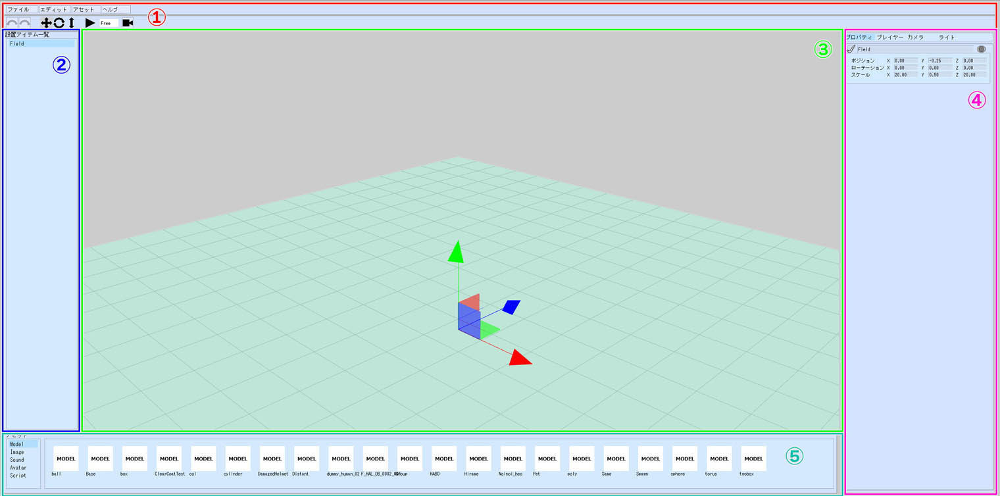

# 各ウィンドウの機能

## ①メニューバー

プロジェクト全体の操作や、汎用的によく使用する操作がまとまっています。

### ファイルメニュー

| 項目名 | 詳細 |
|----|----|
| ログイン/ログアウト | Vket Accountへのログインを行います。ログイン状態であれば、ログインボタンはログアウトボタンに入れ替わります。 |
| プロジェクトを開く | 自身のローカルPC内にあるプロジェクトを開きます。 |
| 新しいワールドを作成 | 新しく何も配置されていない編集中のワールドを作ります |
| ワールドを開いて編集 | [Vket Cloud公式サイト](https://cloud.vket.com)で作成したワールドに、紐づいている編集中のワールドを開きます |
| ワールドを保存 | [Vket Cloud公式サイト](https://cloud.vket.com)で作成したワールドに、編集中のワールドを保存します |
| 別のワールドに保存 | [Vket Cloud公式サイト](https://cloud.vket.com)で作成した別のワールドに、編集中のワールドを保存します |
| PCのワールドを開いて編集 | PC ローカルにある編集中のワールドを開きます |
| PCにワールドを保存 | PC ローカルに編集中のワールドを保存します |
| PCにワールドを別名で保存 | PC ローカルに編集中のワールドを別名で保存します |
| HEOを取り込む | 自分のローカルにあるHEOファイルを取り込みます。 |
| アクティビティを取り込む | 自分のローカルにあるアクティビティフォルダを取り込みます。 |
| ワールドをアップロード | 現在編集している編集中のワールドをマルチプレイ可能な環境にアップロードします。ワールドをアップロードするには、一度サーバーに存在するワールドを開くか、保存する必要があります |
| VketCloudに戻る | [Vket Cloud公式サイト](https://cloud.vket.com)に戻ります |

### エディットメニュー

| 項目名 | 詳細 |
|----|----|
| 元に戻す | 一つ前の操作に戻ります。 |
| やり直し | 戻した動作を一つ先に進めます。 |
| カメラリセット | カメラの移動や回転をリセットして、シーンの原点が中心になるようにカメラを移動します。 |

### アセットメニュー

| 項目名 | 詳細 |
|----|----|
| 立方体を追加 | 白い立方体をシーンに追加します。 |
| 球を追加 | 白い球をシーンに追加します。 |
| カプセルを追加 | 白いカプセル状のモデルをシーンに追加します。 |
| 円柱を追加 | 白い円柱状のモデルをシーンに追加します。 |
| 平面を追加 | 白い板状のモデルをシーン上に追加します。 |
| コライダーを追加 | プレイヤーに接触するコライダーをシーン上に追加します。 |
| エリアコライダーを追加 | プレイヤーが接触すると、トリガーが発火されるコライダーをシーン上に追加します。 |
| テキストプレーンを追加 | テキストが入力できるプレーンをシーン上に追加します。 |
| スクリプトを作成 | HeliScriptのファイルを作成します。 |

### ヘルプメニュー

| 項目名 | 詳細 |
|----|----|
| マニュアル | World Builder Manualを開きます。 |

### ツールバー

| 項目名 | 詳細 |
|----|----|
| 元に戻すボタン | 一つ前の操作に戻ります。 |
| やり直しボタン | 戻した動作を一つ先に進めます。 |
| 移動ボタン | 選択したオブジェクトを移動するためのマニピュレーターを出現させます。 |
| 回転ボタン | 選択したオブジェクトを回転するためのマニピュレーターを出現させます。 |
| 拡大縮小ボタン | 選択したオブジェクトを拡大縮小するためのマニピュレーターを出現させます。 |
| プレビューボタン | シーンのプレビューを開始し、プレイヤーとしてVketちゃん1号が出現します。 |
| カメラ位置ドロップダウン | プレビュー中のカメラ位置を選択します。Free：プレビュー中もカメラを自由に移動できるモードです。TPS：三人称のカメラ視点モードですFPS：一人称のカメラ視点モードです。 |
| カメラリセットダウン | カメラの移動や回転をリセットして、シーンの原点が中心になるようにカメラを移動します。 |
| 編集オブジェクト可視化切り替えボタン | コライダーなど編集用に可視化されているオブジェクトの表示非表示を切り替えます |

## ②設置アイテム一覧パネル

シーン上に配置されたオブジェクトを一覧としてプレビューできるウィンドウです。

オブジェクトを選択して、ドラッグアンドドロップを行うことで設置アイテム一覧上で上下の移動。

オブジェクトを選択して、右クリックを行うことで、オブジェクトの複製と削除。

の操作を行うことができます

| 項目名 | 詳細 |
|----|----|
| 複製 | 選択したオブジェクトを複製します。 |
| 削除 | 選択したオブジェクトを削除します。 |

## ③シーンパネル

実際にオブジェクトを置いたり、置いたオブジェクトを編集したり、プレビュー時に歩き回れるワールドとなる画面です。

オブジェクトの編集に使用するマニピュレーターの操作については、

[マニピュレーターの操作方法](./Manipulator.md)

カメラの操作については、

[カメラの操作方法](./CameraControls.md)

をご参照ください。

## ④セッティングパネル

オブジェクトの設定や、プレイヤー、カメラ、ライトなどシーン全体に作用する設定を行うための画面です。

### プロパティ

タイプごとに設定可能な項目については、

[アイテムごとのプロパティ](./ItemConfig.md)

をご参照ください。

| 項目名 | 詳細 |
|----|----|
| アクティブ非アクティブトグル | アクティブ非アクティブ状態を切り替えます。非アクティブ状態にすると、スクリプトからアクセスできず、ワールドをアップロードした際にもオブジェクトは書き出されません。 |
| 名称設定フィールド | オブジェクトの名称を設定します。 |
| 表示非表示トグル | 選択したオブジェクトの表示非表示状態を切り替えます。 |
| トランスフォーム設定フィールド | 位置、回転、拡大縮小を数値入力で設定できます。 |

### プレイヤー

| 項目名 | 詳細 |
|----|----|
| ポジション | プレイヤーがスポーンする際の座標を指定します。 |
| ローテート | プレイヤーがスポーンする際の角度を指定します。なお、本設定はY軸の角度のみ反映されます。 |
| ジャンプ | ワールド内でジャンプの有効/無効を切り替えます。 |
| ジャンプ速度 | ワールド内でジャンプした際の上向きの初速度を指定します。 |

### カメラ

| 項目名 | 詳細 |
|----|----|
| スムージング | カメラの上下の動きにスムージングをかけるかどうかを指定します。 |

### ライト

| 項目名 | 詳細 |
|----|----|
| ディレクション | XYZのベクトルを指定します（回転角度ではなくベクトルであることに注意してください） |
| カラー | ライトの色を設定します |

## ⑤アセットパネル

プロジェクト内にあるアセットをプレビューします。

ここに表示されているアセットを設置アイテム一覧パネル、もしくはシーンパネルにドラッグアンドドロップすることで、シーン上にオブジェクトを配置できます。

| 項目名 | 詳細 |
|----|----|
| Model | シーン上に配置することで、3Dモデルが表示されます。対応拡張子：heo、glb |
| Image | シーン上に配置することで、一枚の画像として表示されます。対応拡張子：png |
| Sound | シーン上に配置することで、BGMやSEとして再生されます。（シーンビルダー上では現時点ではプレビューできません）対応拡張子：mp3 |
| Avatar | 設定できません |
| Script | アセット＞Scriptを追加　から追加したHeliscriptが表示されます。Modelとして追加したアイテムにスクリプトとしての追加や、Action TriggerのCallScriptで呼び出すことで使用できます。対応拡張子：hs |
| Activity | シーン上に配置することで、アクティビティが表示されます。対応拡張子：json |
