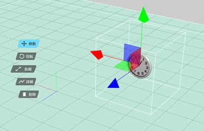

# アクティビティの使い方

アクティビティとはモデル・スクリプトをひとまとめに統合し、ワールドへの配置と設定を便利にするための機能です。
アクティビティを使うことで自分でギミックを作成しなくても、自分のワールドにギミックが設定されたアイテムを配置することが出来ます。

デフォルトアイテムから、アクティビティタブに移動することで、アクティビティを利用することができます

## デフォルトアイテム以外のアクティビティの入手方法について

Vket Cloudのアクティビティはアセットストアにて入手が可能です。 

アセットストアは[Vket Cloudマイページ](https://cloud.vket.com/){target=_blank}にログイン後、画面上部のタブにおける「アセットストア」からアクセスが可能です。

アセットストアのアクセス方法、使い方の詳細は以下のマニュアルページをご確認ください。
[便利機能をお手軽にインストール！Vket Cloudアセットストア・アクティビティの使い方](https://magazine.vket.com/n/n7d554dbeb552){target=_blank}

## 設定方法

例として、ここではアセットストアにて入手したアナログ時計アクティビティを使用します。 
アクティビティの入手方法は後述のマニュアルをご確認ください。

1\. ダウンロードしたActivityファイルを解凍します。OSごとに方法が異なりますが、お好みの方法で解凍してください。

2\. ファイル内容を確認し、必ずREADMEをご確認ください。

3\. ファイル > アクティビティを取り込み から、解凍したanalogclockフォルダーを選択します。
ここで選択するのはアクティビティのjsonファイルが格納されている親のフォルダーであることを確認してください。

4\. これによってアナログ時計アクティビティがアセットパネルに出現します。

5\. シーンパネルに配置することでアクティビティが出現していれば完了です。

6\. アクティビティは詳細という個別の設定項目を入力することでアクティビティをカスタマイズすることが出来ます。
どのパラメータがカスタマイズできるのかを事前に「アクティビティ設定」項目でご確認ください。

