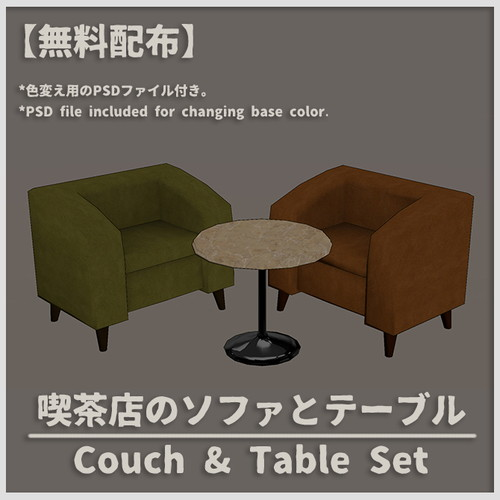
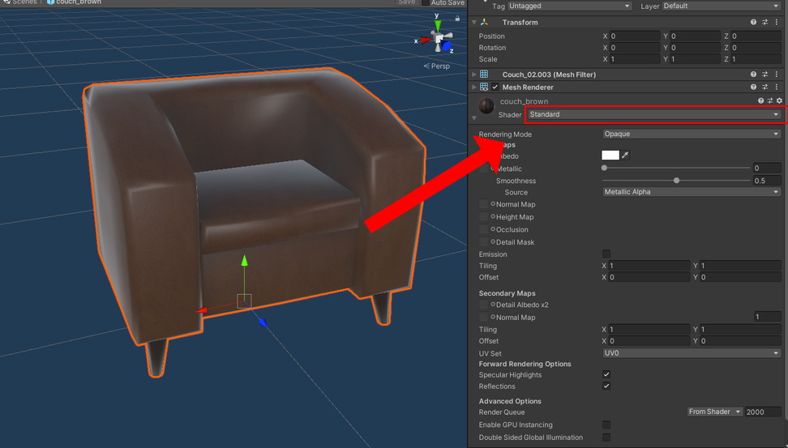
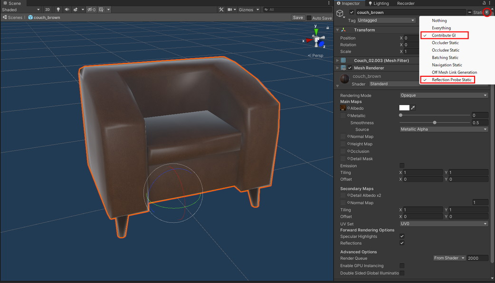
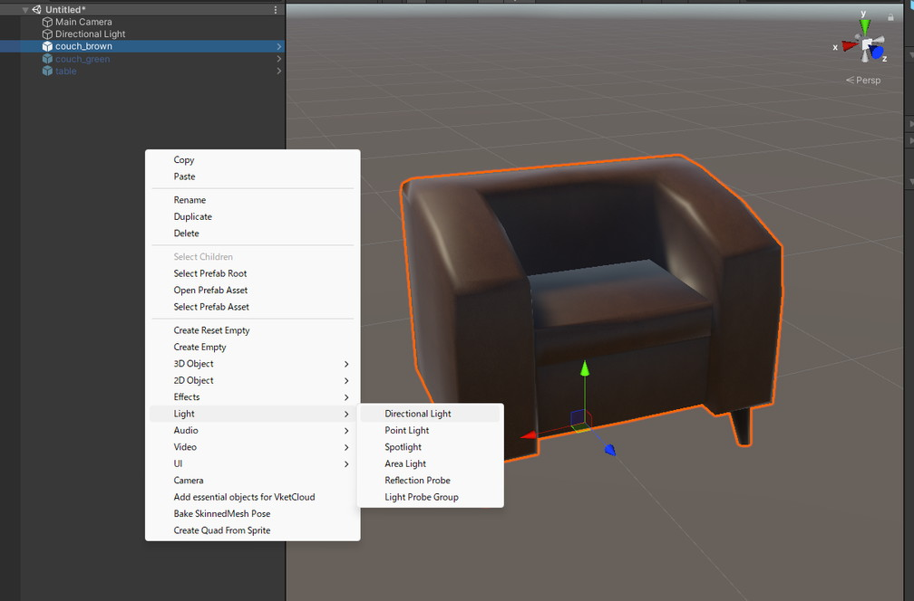
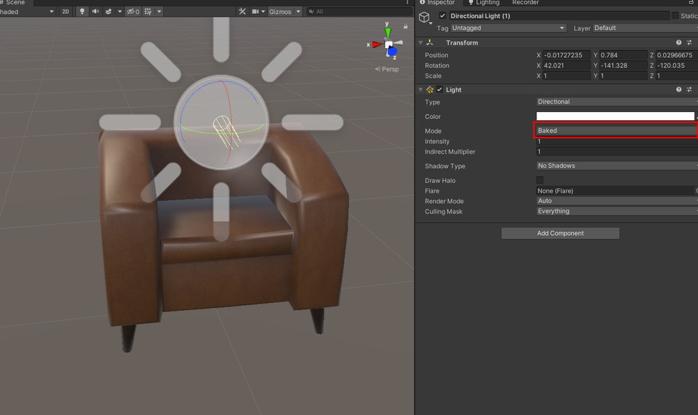
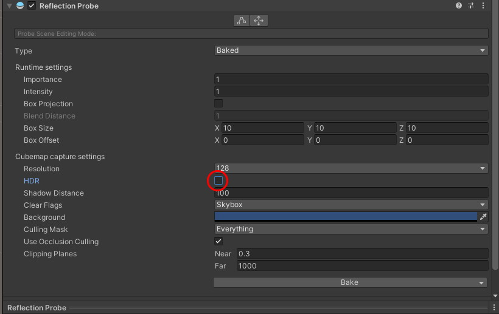
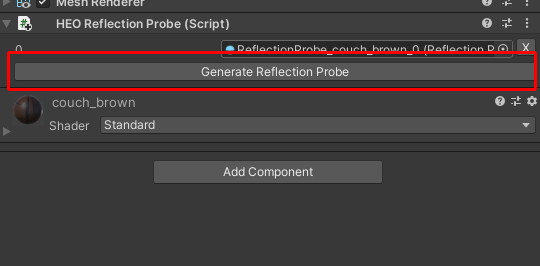
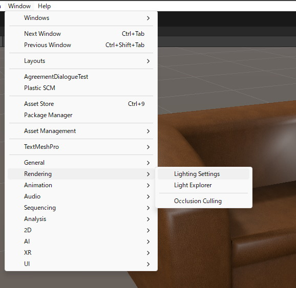
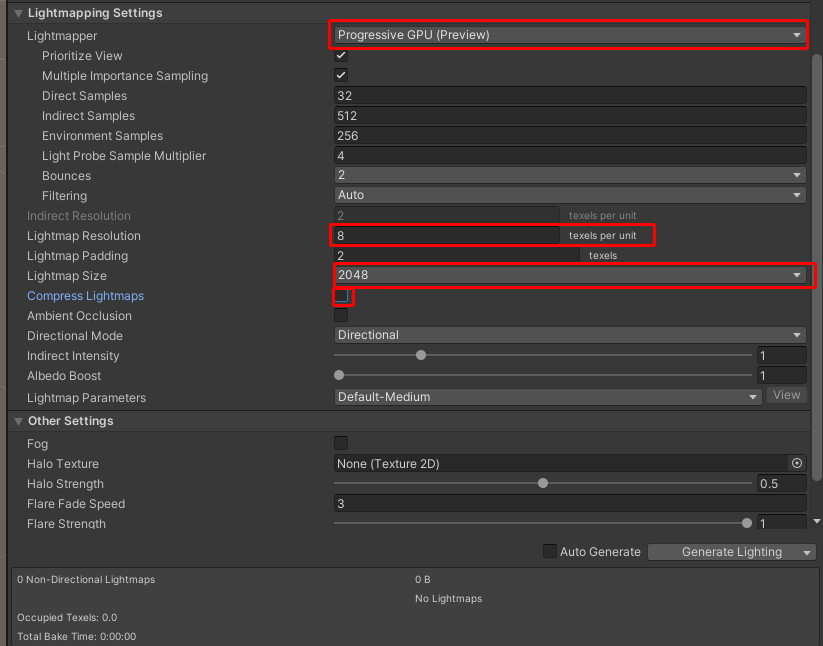
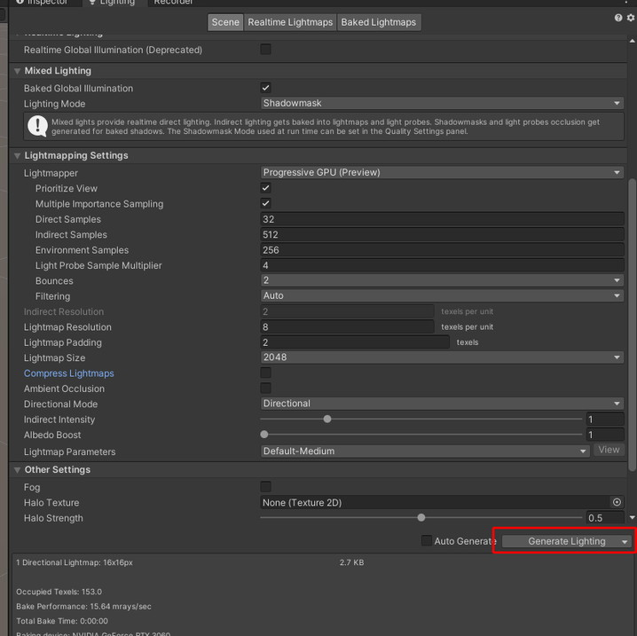

# アセットのライトマップとReflection Probeのベイクについて

Scene Builderで使用できるheoファイルは、ライトとリフレクションプローブのベイクが行えます。

手順として複雑になりますが、シーン上の直接光による光と影の影響を受けず、さらに、複雑な陰影表現や、金属光沢によるよりリアリティのある表現が行えます。

例として、今回は[Vket Storeで入手したモデル](https://store.vket.com/ja/items/7530)を使用します。

[【無料配布】カフェのソファとテーブルセット【VRChat】](https://store.vket.com/ja/items/7530)

!!! warning "注意"
    Scene Builderにモデルをアップロードする際は、モデルの利用ライセンスあるいはガイドライン等に違反していないか注意してください。

まず初めに、モデルを選択した上でインスペクター画面下のマテリアルから**Shader**の項目を変更します。  
例として、以下の画像では「Standard」を選択しマテリアルの設定を変更しています。

次にライトのベイク用の設定を行います。

モデルを選択した状態で、インスペクタ画面右上のStatic▼の▼をクリックし、Contribute GIと、Reflection Probe Staticにチェックを入れます。

次に、Hierarchyウィンドウ上で右クリックし Light>Directional Lightを選択し、シーン上にDirectonal Lightを追加します。（既にシーン上にDirectional Lightがあるのであればそれを使用していただいても問題ありません）

追加したライトの角度を調節し、 LightコンポーネントのModeの項目をBakedに変更します。

次に、リフレクションプローブの設定を行います。

モデルを選択した状態で、Add ComponentからHEO Reflection Probeを選択します。

HEO Reflection Probeコンポーネントが追加されたら、Generate Reflection Probeをクリックし、Reflection Probeを生成します。

生成されたReflection Probeコンポーネントを選択し、HDRのチェックを外します。

最後にライトのベイクを行います。

Window>Rendering>Lighting SettingからLightingウィンドウを開きます。

開いたウィンドウのSceneタブの下にスクロールし、下記の対応を行ってください。

（これはあくまで一例です。ライトのベイクは奥が深いため必要に応じてパラメーターを調整してください）

- LightmapperをProgressive GPU(Preview)

- Lightmap Resolutionを8（求めるクオリティと容量によって調整可能です）

- Lightmap Sizeを2048

- Compress Lightmapsのチェックを外す

ここまで行ったら、Lightingウィンドウの右下にあるGenerate Lightingボタンを押します。

（シーンを保存してなかった場合は保存してください）

数秒～数分待つとライトベイクが完了するため、このオブジェクトをheoとして変換してください。

変換を行うには、[アセットの再フォーマット](../GettingStarted/ReformattingAssets.md)の記事を参照しながら書き出しを行ってください。

上記の手順はheoファイルのライトとリフレクションプローブのベイクを行うのに最低限の手順を記したものです。

ライトの数や色を増やしたり、映り込むモデルを調整したりすることでより高度な表現を行うことができるようになります。
