# ギミックを作成する

World Builderでギミックを追加するには、モデルのクリックでギミックの発火、もしくは、エリアコライダーを追加して、プレイヤーの侵入か退出を検知することでギミックの発火を行います。

## モデルのクリックでアクションの発火

シーン上にモデルのクリックするためのオブジェクトを追加します。今回はクリック判定用のオブジェクトである、クリックコライダーをデフォルトアイテムの、モデルタブから追加します。

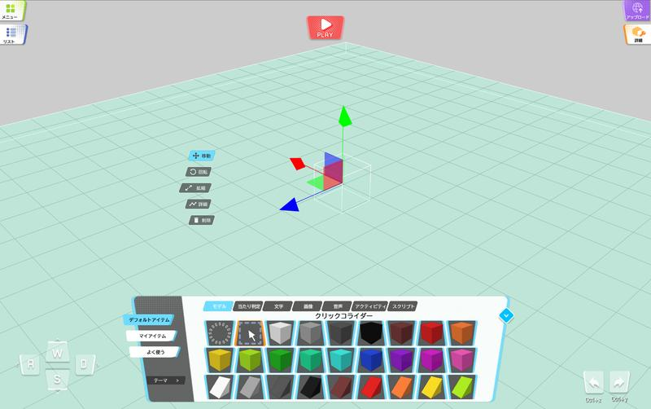

クリックするためのオブジェクトを選択し、プロパティパネルのクリッカブルノード欄にある【追加】ボタンを押下することで、アクションを追加するための、入力欄が追加されます。

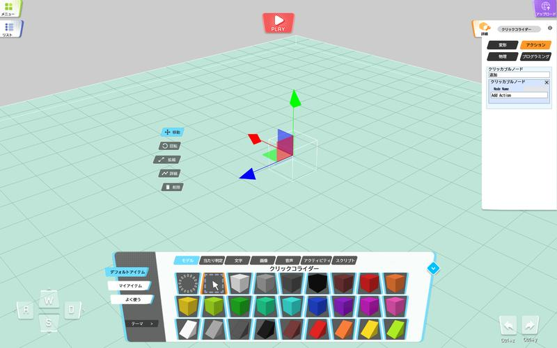

Node Name（ノードネーム）にクリック対象のノードを選択します。

1つしかノードが存在しない場合、ノードは1つだけ表示されます。

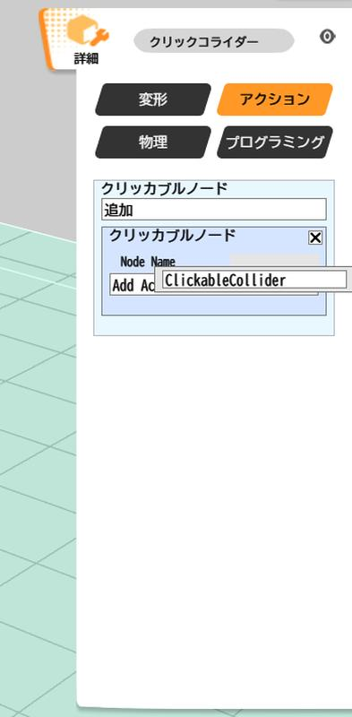

Add Actionボタンを押下することで、アクションを追加するための様々なメニューが表示されます。

アクションについての詳細は[アクション](../Actions/ActionsOverview.md)をご参照ください。

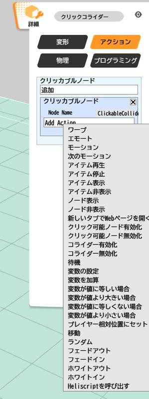

ここでは、新しいタブでWebページを開くを選択し、URLの欄に任意のURLを追加します。

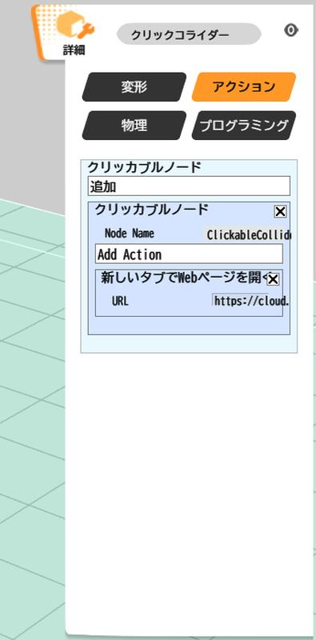

この設定を行ったうえで、画面左上の再生（▶）ボタンを押すと、プレイヤーが表示されます。

その状態で、再生ボタンの右にあるカメラ設定（初期設定ではFreeが設定されています）をクリックし、TPS、もしくはFPSを選択すると、ギミックの動作確認を行うことができます。

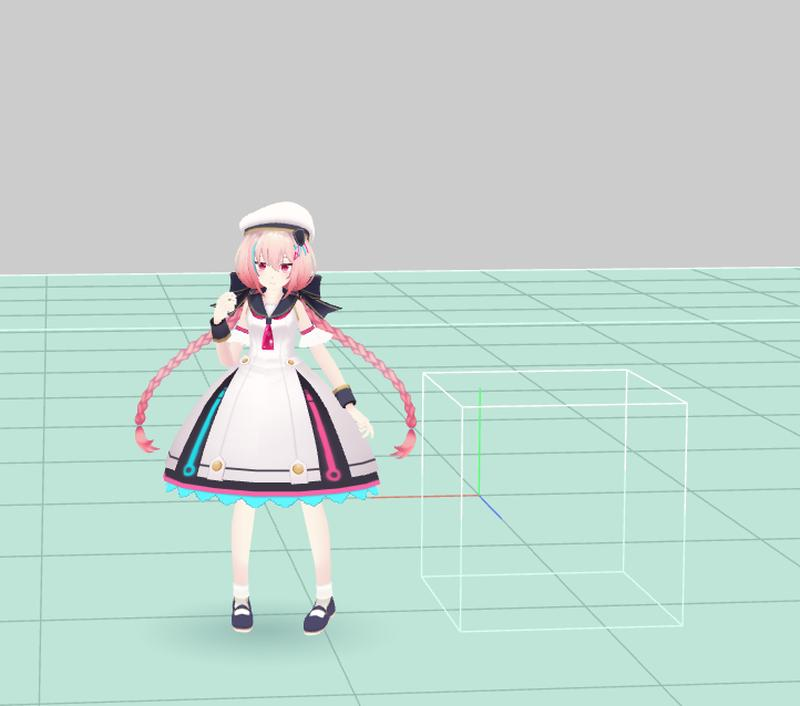

この状態でクリックするためのオブジェクトをクリックすると、アクションが動作し、新しいタブでWebページを開くであれば別のWebサイトに遷移することが確認できます。

## エリアコライダーでアクショントリガーの発火

!!! note
    エリアトリガーの注意点として、エリアトリガーの入退出の判定は、プレイヤーの足元にあり、頭などがエリアコライダーに触れていてもアクションが実行されないことがあります。

シーン上にエリアコライダーを追加します。エリアコライダーとは、そのコライダー内に侵入、もしくは退出することで、アクションが実行される特殊なコライダーのことです。

アセット > エリアコライダー から、エリアコライダーの追加を行うことができます。

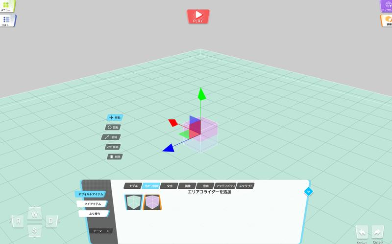

エリアコライダーを選択し、エリアコライダーに侵入したときに動作させたい場合は、**アクション** に、エリアコライダーから退出したときに動作させたいときは、 **リーブアクション** にアクションを設定します。

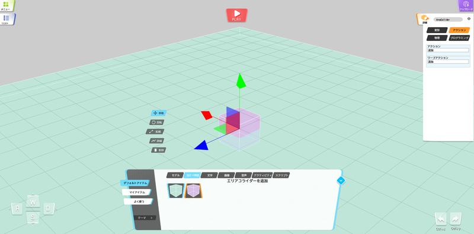

追加ボタンを押下することで、アクションを追加するための様々なメニューが表示されます。

アクションについての詳細は[アクション](../Actions/ActionsOverview.md)をご参照ください。

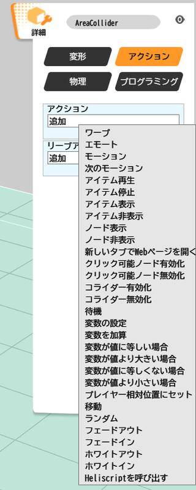

ここでは新しいタブでWebページを開くを選択し、URLの欄に任意のURLを追加します。

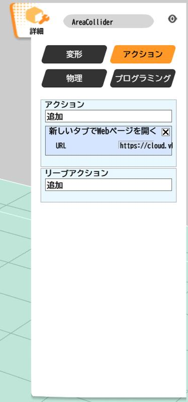

この設定を行ったうえで、画面左上の再生（▶）ボタンを押すと、プレイヤーが表示されます。

その状態で、WASDボタンで、キャラクターを操作し、エリアコライダーに触れることでアクションが動作し、新しいタブでWebページを開くであれば別のWebサイトに遷移することが確認できます。

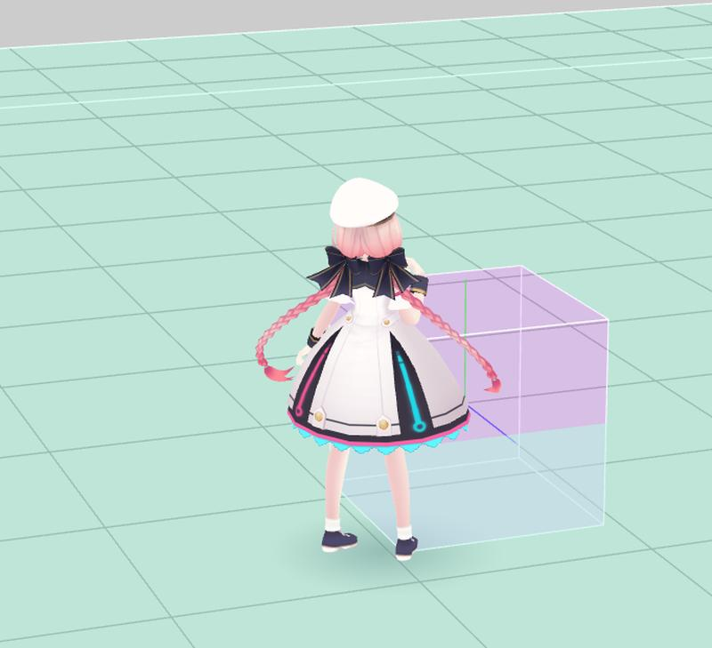

## モデルのクリック、もしくはエリアコライダーからHeliscriptの発火

アクションの中にCall ScriptというHeliscriptを呼び出すためにアクションが存在します。

そちらからスクリプトの呼び出しを行えますので、ご利用ください。

また、Heliscriptには、クリックしたノード、もしくは侵入、退出したエリアコライダーを取得するコールバック関数が存在しますので、そちらを利用してもスクリプトの発火を行うことができます。
