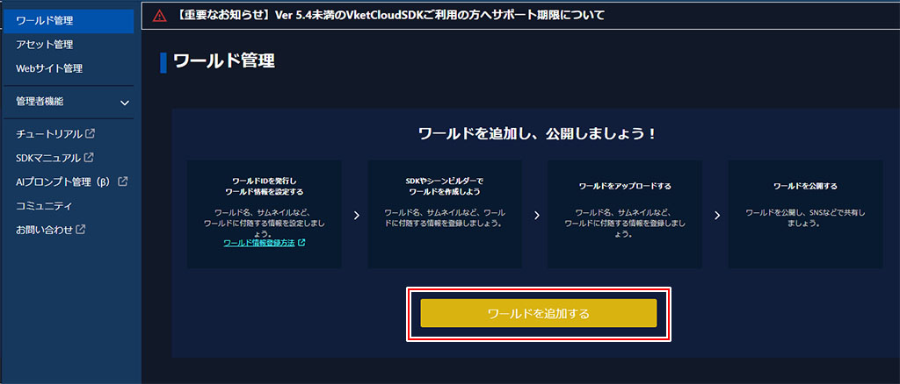
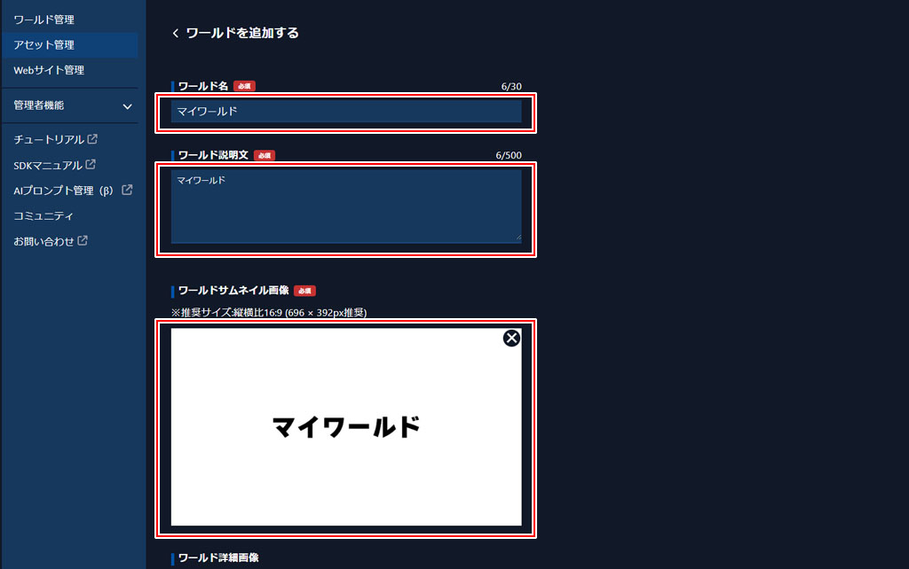
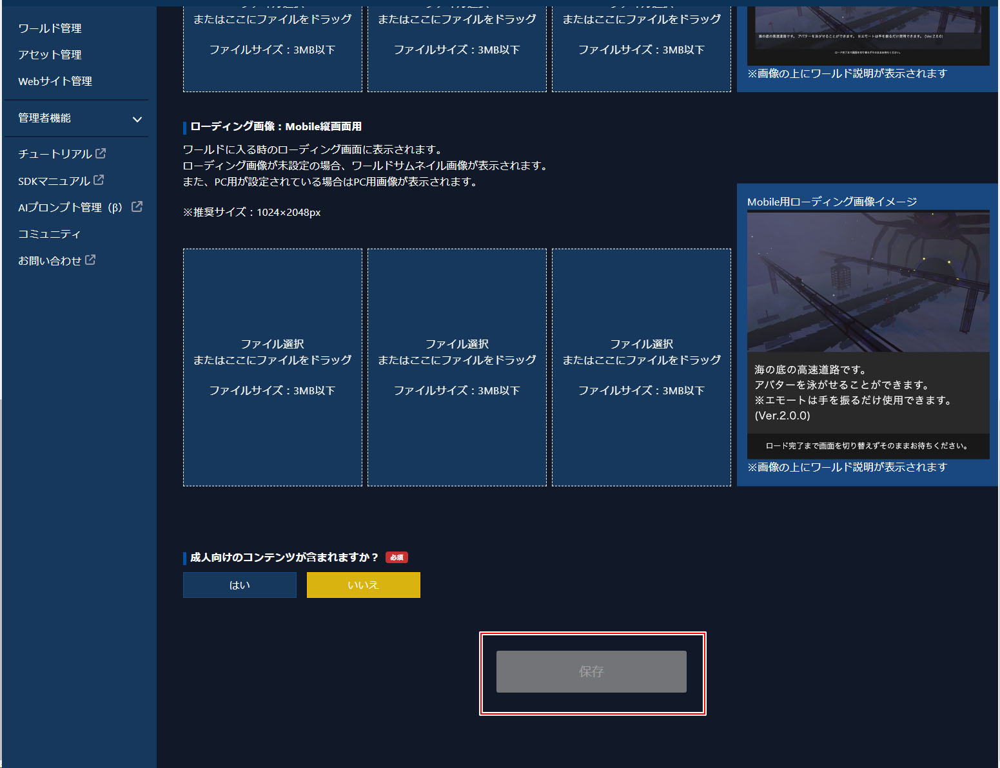
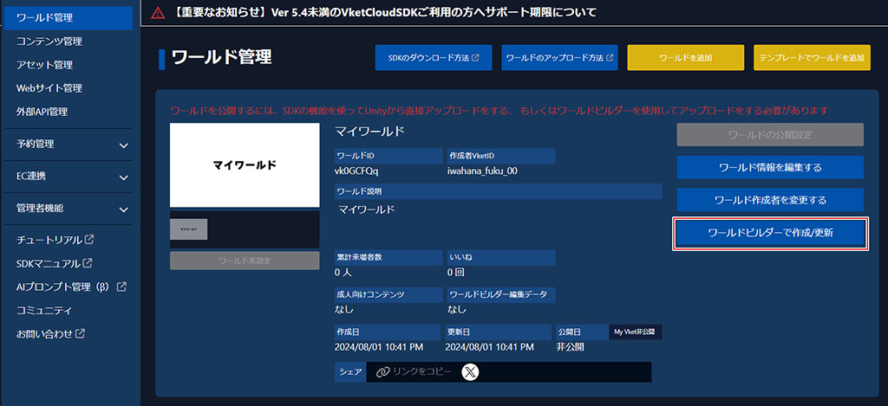
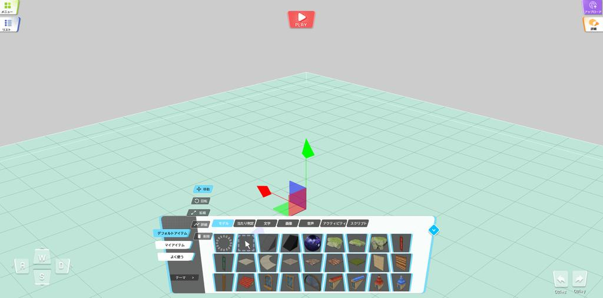
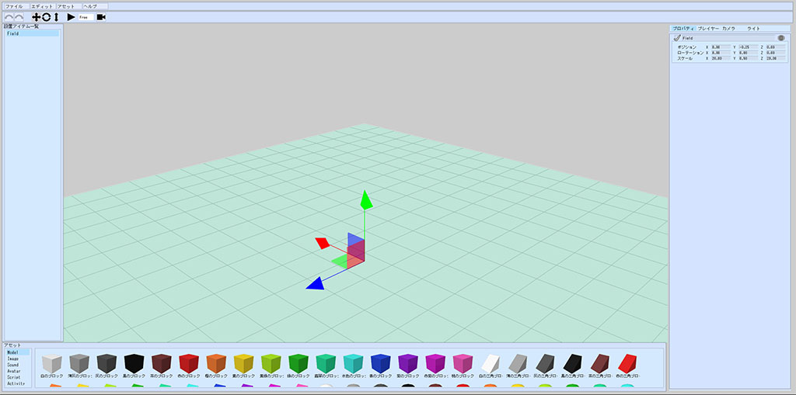

# ワールドの作成

## ワールドを追加

World Builderでワールドアップロード機能や、サーバー上へ編集中のワールドを保存する機能などを利用するには、Vketアカウントの作成と、VketCloudサイトでのライセンスIDの登録が必要です。

## VketCloud公式サイトにアクセスする

[VketCloud公式サイト](https://cloud.vket.com/)にアクセスします。

まだ、チームIDの取得を行っていない場合は、

[Account準備](SetupAccount.md)から、チームIDの作成を行ってください。

## ワールドを追加登録する

一度もワールドを作成したことがない場合、ページの中央にあるワールドを追加するボタンを押下します。

ワールド名、ワールド説明文、ワールドサムネイル画像を入力して、ページ最下部の保存ボタンを押下します。

保存が完了したら、ワールド管理ボタンを押下して、ワールド管理に戻ります。

## ワールドビルダーに移動する

ワールドの追加登録が完了したら、いよいよワールドビルダーに移動します。

新しく登録したワールドの右側にある、ワールドビルダーで作成/更新ボタンを押下します。

World Builderが開けたら、どのプロジェクトを開くか問われます。

プロジェクトを開くボタンを押すと、フォルダ選択ダイアログが開かれるので、任意の場所に新しいフォルダを作ります

モーダルの表示が消え、操作ができるようになったら成功です。

