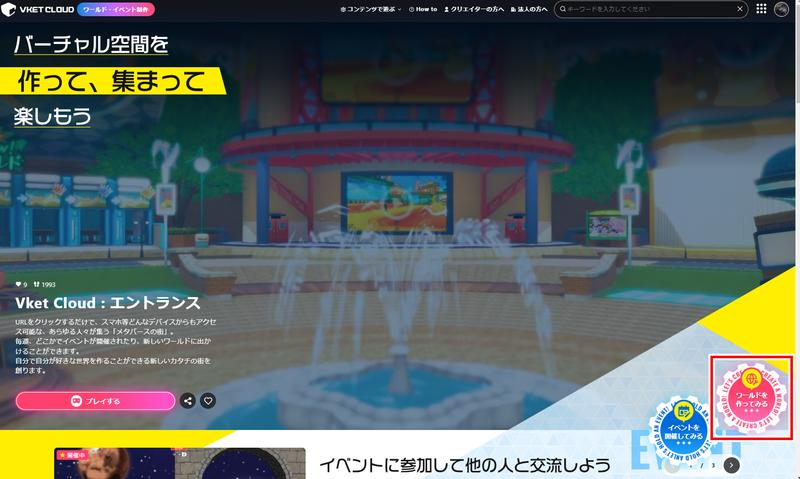
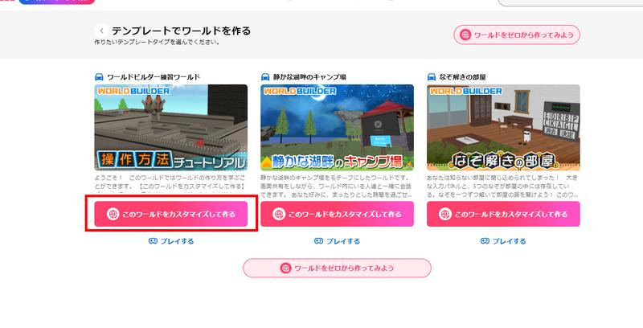
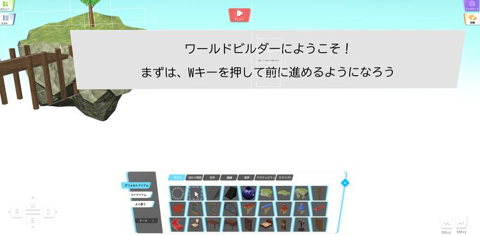
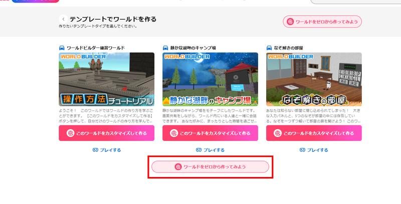
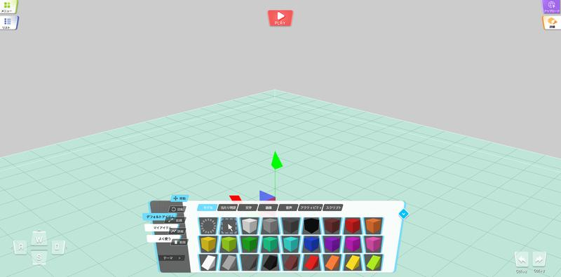

# ワールドの作成

## ワールドを追加

World Builderでワールドアップロード機能や、サーバー上へ編集中のワールドを保存する機能などを利用するには、Vketアカウントの作成と、VketCloudサイトでのライセンスIDの登録が必要です。

## VketCloud公式サイトにアクセスする

[VketCloud公式サイト](https://cloud.vket.com/)にアクセスします。

まだ、チームIDの取得を行っていない場合は、

[Account準備](SetupAccount.md)から、チームIDの作成を行ってください。

## ワールドビルダーに移動する

画面右下の「ワールドを作ってみる」を押します。

テンプレートワールドとして、ワールドが表示されます

### テンプレートワールドからワールドを作り始めたい場合

「このワールドをカスタマイズして作る」から、すでに出来上がったワールドを参考にしながらワールドを作り始めることができます。

ワールドビルダーの操作に慣れていない人は、操作方法チュートリアルワールドの「このワールドをカスタマイズして作る」を押すと、ワールドビルダーの操作を学ぶことができるテンプレートワールドを開くことができます。

表示されている文言に沿いながら操作をすることで、ワールドビルダーでワールドを作るための操作方法を一通り学ぶことができます。

### ゼロからワールドを作り始めたい場合

「ワールドをゼロから作ってみよう」から、何もない配置されていないワールドを開くことができます。

ゼロからワールドを作り始めたい場合はこちらからワールドビルダーを開くことで、新しいワールドを作ることができます。

