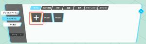
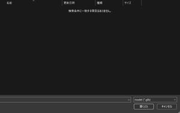
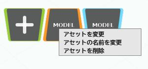
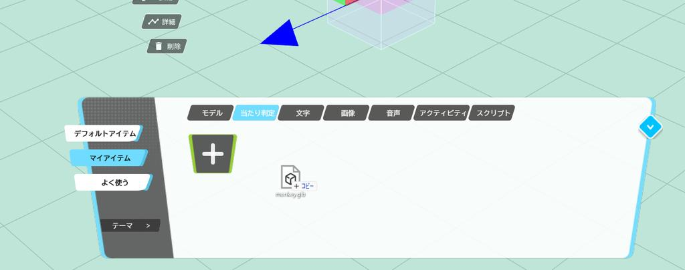
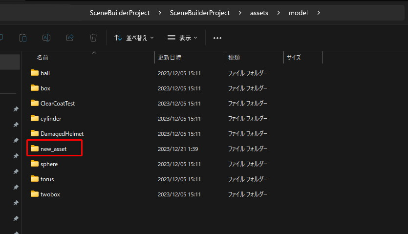
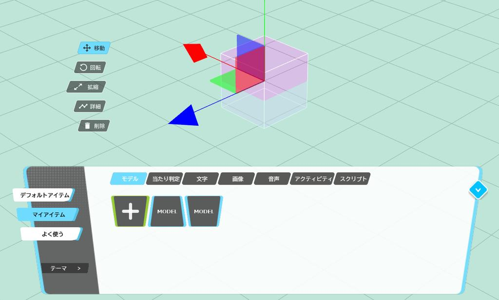

# アイテムの読み込み・配置

World Builderに自分のアイテムを追加するには、アイテムパネルの各タブのプラスボタンから、アイテムをアップロードするか、PC上にフォルダとしてプロジェクトを作成し、そこに対してモデルや画像を追加する必要があります。

!!! note ".heo、.glb以外の3Dモデルを追加したい場合"
    3Dモデルのフォーマットを、blenderや、Unityで変更する必要があります。

    [3Dモデルの再フォーマットとは](Reformatting3DModels/WhatIsReformatting3DModels.ja.md) から、フォーマットの変更を行ってください。

## アイテムをアップロードする

アイテムをアップロードするには、アイテムパネルのマイアイテムから、各アイテムのタイプごとのタブを選択し、プラスボタンを押すことでアップロードすることができます。

プラスボタンを押すことで、ファイルを選択するためのウィンドウが開きます。

アップロードが完了すると、アイテムが各タブに追加されます。

サーバーにアップロードしたアイテムを選択して右クリックすることで、アイテムの編集を行うことができます。

| 名称 | 機能  |
| ----   | ---- |
| アセットを変更 | 登録したアイテムのファイルを更新します。更新したアイテムはWorld Builderを再読み込みすることで反映されます。 |
| アセットの名前を変更 | 登録したアイテムの名称を変更します |
| アセットを削除 | 登録したアイテムを削除します。　削除したアイテムのURLは失効しないためすでにアップロードしたアイテムは残り続けます |

## プロジェクトにアイテムを追加する

プロジェクトとは、自身のPC上に作成した、ワールドビルダー用のフォルダのことです。
ここに追加されたアイテムは、ほかの端末に共有されません。

| 項目名 | 詳細 |
|----|----|
| model | 3Dモデル（.heo、.glb）を格納するフォルダです。|
| image | プレーンとして配置する画像（.png）が格納されるフォルダです。|
| sound | サウンド（.mp3）を格納するフォルダです。|
| avatar | 現在のバージョンでは使用できません。|
| script | スクリプト（.hs）を格納するフォルダです。 |
| activity| アクティビティ（.json）を格納するフォルダです。 |

### 単一ファイル（.glb、.png、.mp3、.hs）の取り込み
この内、modelの.glb、imageの.png、soundの.mp3、スクリプトの.hsファイルといった単一ファイルはアイテムパネルにドラッグアンドドロップすることで、プロジェクトに自動的に追加することが出来ます。

!!! warning "日本語のファイル名について"
    ファイル名に日本語などの2バイト文字が含まれている場合、インポートが成功しないことがあります。ファイル名は半角英数字で登録してください。

!!! warning "8mb以上のglbは読み込めません"
    現バージョンでは、8mb以上のglbファイルをワールドに配置しようとすると、World Builderがフリーズします。
    
    お手数ですが、blenderなどでモデルの軽量化や、画像編集ソフトでのテクスチャの軽量化を行ってください。

### ファイルをプロジェクトフォルダに直接配置する

プロジェクトフォルダのassetフォルダに、直接モデルの追加を行う事も出来ます。
フォルダ（HEO、アクティビティの取り込み）は、プロジェクトフォルダに直接追加する必要があります

たとえば、modelを追加するには、orld BuilderのProject>assets>modelに移動して、サポートしている3Dモデルを追加します。

World Builderで、モデルを追加したプロジェクトを開きアイテムパネルのモデルタブを見ると、追加したアセットが表示されていることが確認できます。

もしプロジェクトをブラウザで開いている状態でアセットの追加作業を行った場合、画面上で追加したアセットが反映がされない場合があります。

その際は、アイテムパネルの別のタブに移動して、再度戻ると反映されます。
