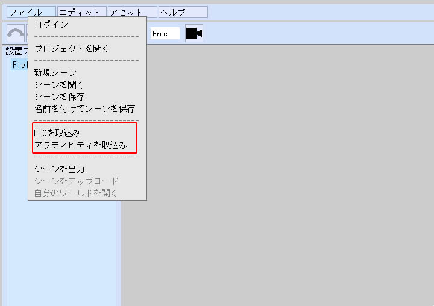

# アイテムの読み込み・配置

World Builderにアイテムを追加するには、ローカルのプロジェクトフォルダのassetフォルダ配下にある適切なフォルダに対して、モデルや画像を追加する必要があります。

| 項目名 | 詳細 |
|----|----|
| model | 3Dモデル（.heo、.glb）を格納するフォルダです。|
| image | プレーンとして配置する画像（.png）が格納されるフォルダです。|
| sound | サウンド（.mp3）を格納するフォルダです。|
| avatar | 現在のバージョンでは使用できません。|
| script | スクリプト（.hs）を格納するフォルダです。 |
| activity| アクティビティ（.json）を格納するフォルダです。 |

## .heo、.glb以外の3Dモデルを追加したい場合
3Dモデルのフォーマットを、blenderや、Unityで変更する必要があります。

[3Dモデルの再フォーマットとは](Reformatting3DModels/WhatIsReformatting3DModels.ja.md) から、フォーマットの変更を行ってください。

## 単一ファイル（.glb、.png、.mp3、.hs）の取り込み
この内、modelの.glb、imageの.png、soundの.mp3、スクリプトの.hsファイルといった単一ファイルはアイテムパネルにドラッグアンドドロップすることで、自動的に追加することが出来ます。

## フォルダ（HEO、アクティビティの取り込み）
modelのHEO、もしくはアクティビティに関しては、メニューバーのファイルから、modelのHEOであれば、HEOを取り込み、アクティビティであれば、アクティビティを取り込みからプロジェクトに追加することが出来ます。

エクスプローラーが開かれるので、この時、.heo、もしくは、activityのjsonが含まれる、**フォルダ** を選択してください

## ファイルをプロジェクトフォルダに直接配置する

プロジェクトフォルダのassetフォルダに、直接モデルの追加を行う事も出来ます。

たとえば、modelを追加するには、orld BuilderのProject>assets>modelに移動して、サポートしている3Dモデルを追加します。

World Builderで、モデルを追加したプロジェクトを開きアイテムパネルのモデルタブを見ると、追加したアセットが表示されていることが確認できます。

もしプロジェクトをブラウザで開いている状態でアセットの追加作業を行った場合、画面上で追加したアセットが反映がされない場合があります。

その際は、アイテムパネルの別のタブに移動して、再度戻ると反映されます。
