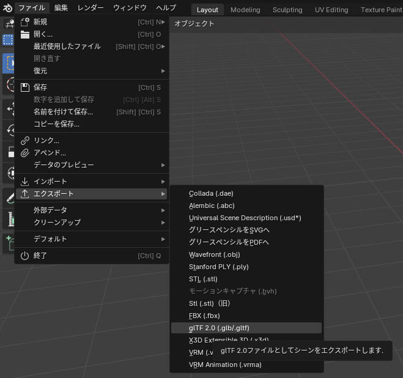
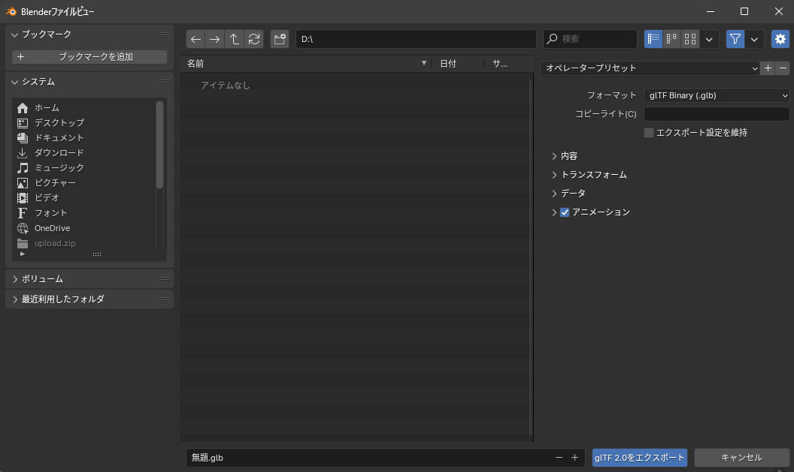

# Blenderを使用してglbファイルを書き出す

Blenderを利用したglbファイルへの変換では、.fbx、.obj、.dae ([Collada](https://www.khronos.org/collada/){target=_blank})ファイルなどのblenderで使用可能なファイルフォーマットを利用することができます。

本記事中では、Blender 4.1を利用しています。

## モデルをglbで出力する

書き出したいモデルをblender上に表示した状態で、ファイルタブから、エクスポートを選択し、glTF 2.0(.glb/gltf)を選択します。

フォーマットが glTF Binary (.glb)になっていることを確認して、glTF 2.0をエクスポートボタンを押下します。

モデルによりますが、内容などは特に変更せずに出力します。

これで、glbファイルの書き出しは完了です。