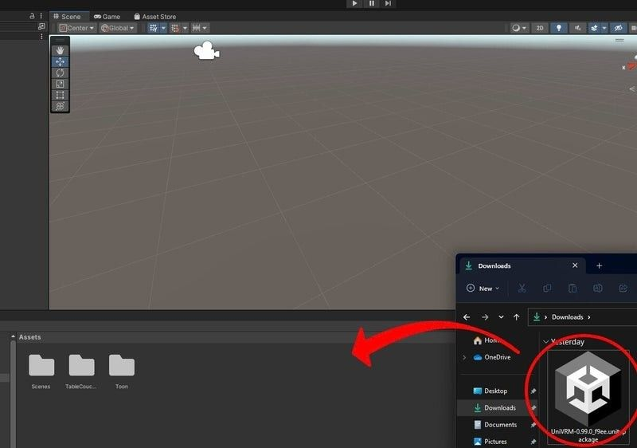
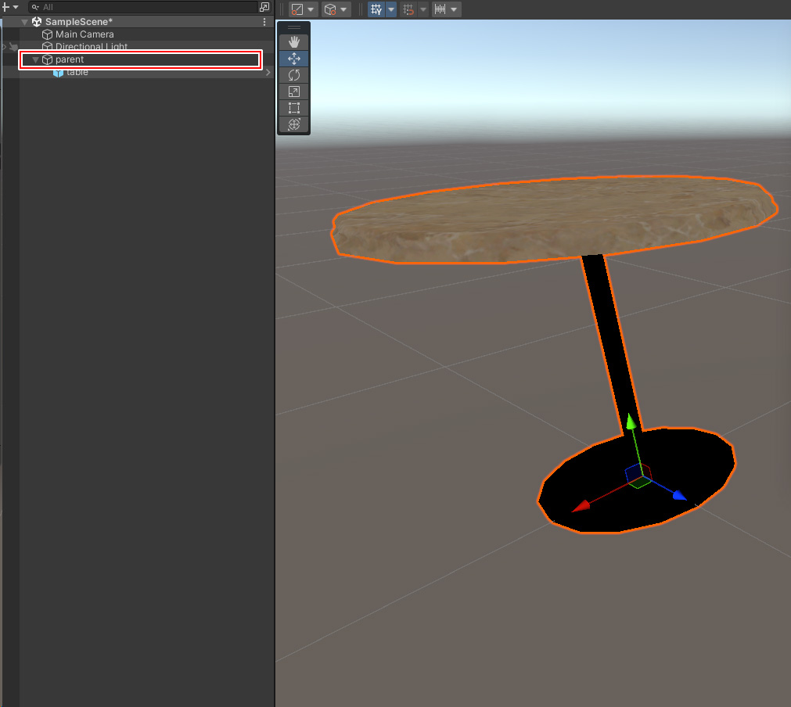
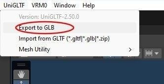
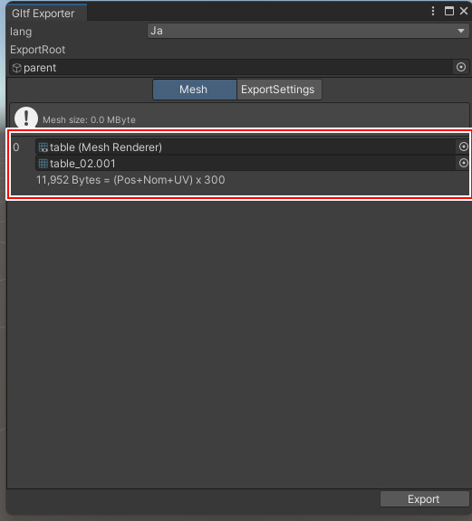
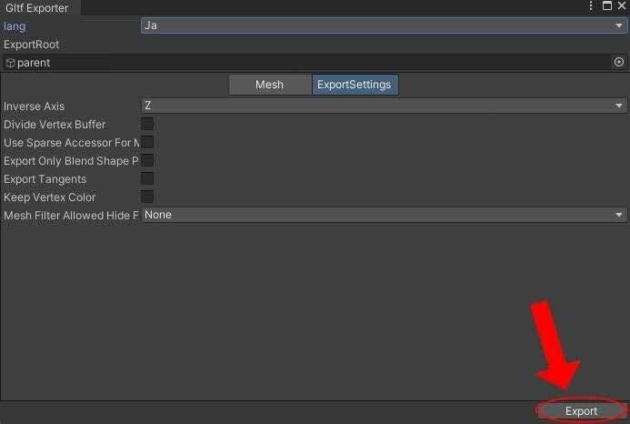

# UniVRMを使用してglbファイルを書き出す

UniVRMを使用したglbファイルへの変換では.fbx、.obj、.dae ([Collada](https://www.khronos.org/collada/){target=_blank})、そして.dxfファイルが[使用できます](https://docs.unity3d.com/ja/2022.3/Manual/3D-formats.html){target=_blank}。

### UniGLTF (UniVRMの導入)

はじめに、glbファイルを出力するための環境を用意します。
Blenderなどのモデリングソフトから直にglbファイルを出力することもできます。今回の場合は使用したいモデルがUnitypackageに格納されているため、マテリアルやサイズ調整の利便性を踏まえてUnityを使って作業します。

glbファイルへの変換を行うにあたって、VRM Consortiumが配布している[UniVRMパッケージ](https://github.com/vrm-c/UniVRM/releases){target=_blank}内の[UniGLTF](https://vrm.dev/gltf/index.html){target=_blank}を使用します。
VRMはglTF規格の拡張であるため、本ライブラリの導入によってUnityでのglbファイル出力が容易になります。

本ページ公開時点では最新のUniVRMが対応するUnityバージョンが2021.3LTS以降のため、本ページでは2022.3.8f1を使用しました。
UniVRMは[UnityPackageをダウンロードする](https://github.com/vrm-c/UniVRM/releases/tag/v0.114.0){target=_blank}か、UPMでパッケージを指定して導入します。

ダウンロードが完了したら、UnityPackageをエディター内にドラッグ＆ドロップしてインストールします。

インストールが完了したら、モデルをglbに変換します。

### シーンに書き出したいモデルを配置する
GLBとして書き出したいモデルを設定するために、対象のモデルをシーン上に配置します。

その際、書き出したいメッシュは、すべて選択しているオブジェクトの**子オブジェクト**として配置する必要があるため、空のオブジェクトを追加し、それを親オブジェクトとします

### モデルをglbで出力する

UniGLTFタブからExport to GLBを選択します。

Gltf Exporterウィンドウが表示されるので、Meshタブにて、

* ExportRootとして、追加した親オブジェクト。
* リストとして、書き出したいメッシュ

それぞれが表示されるようになっていれば成功です。

モデルによりますが、Exporterの設定は特に変更せずに出力します。

これで、glbファイルの書き出しは完了です。