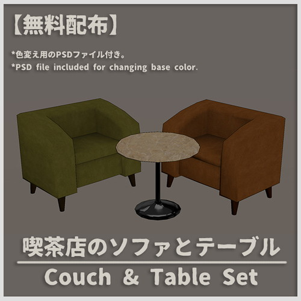
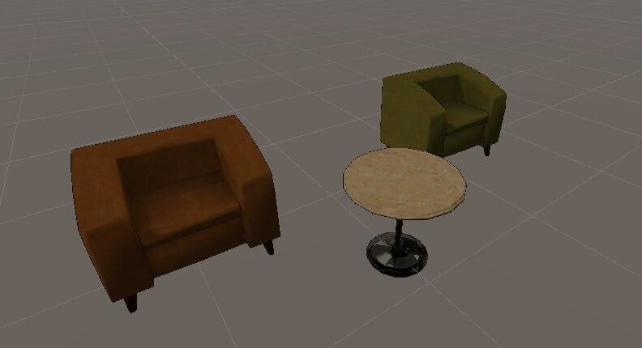
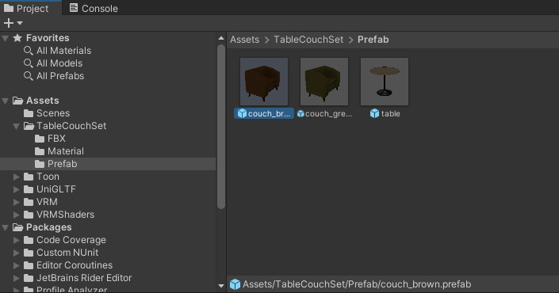
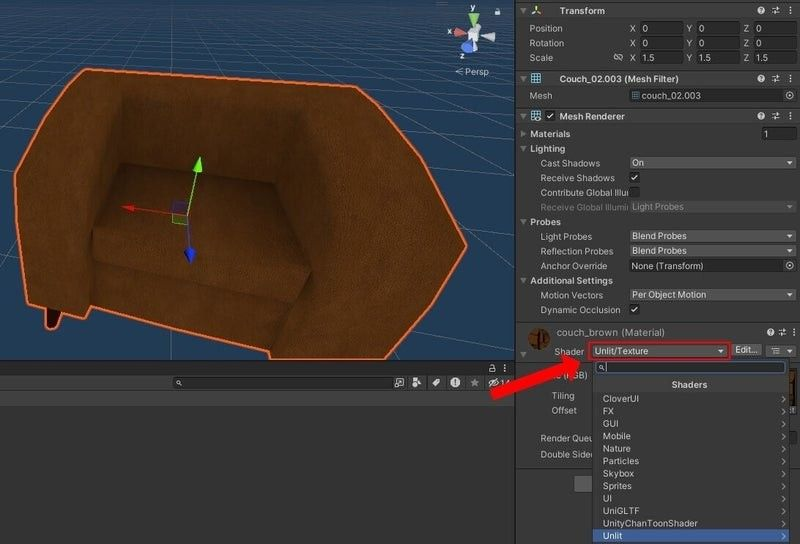

# Unityでの準備

Unityで3Dモデルの再フォーマットを行う前に、使用する3Dモデルを用意します。

例として、今回は[Vket Storeで入手したモデル](https://store.vket.com/items/7530){target=_blank}と、モデルに使用しているシェーダーをUnlitシェーダーに変換して、書き出しを行います。

[【無料配布】カフェのソファとテーブルセット【VRChat】](https://store.vket.com/items/7530){target=_blank}

!!! note warning
    ※World Builderにモデルをアップロードする際は、モデルの利用ライセンスあるいはガイドライン等に違反していないか注意してください。

## 下準備：見た目の調整

### Unityでモデルを調整する

Unityプロジェクトを作成し、用意したモデルをUnityプロジェクトに導入し、シーン画面へとモデルのデータを投下します。

モデルのprefabファイルが用意されている場合はprefabを使用します。

本モデルの場合、シェーダーとしてUTS (UnitychanToonShader)が割り当てられています。
このまま各ファイルに変換してアップロードすることもできますが、World Builder上での見た目が暗くなる可能性があるため、**Unlit**シェーダーへと変換します。

### Unlitシェーダーへの変換

Unlitシェーダーへ使用しているシェーダーを変換することで、シーン上の直接光による光や影の影響を受けなくなります。

3Dモデルに割り当てられているシェーダーを変更するには、モデルを選択した上でインスペクター画面下のマテリアルからShaderの項目を変更します。
例として、以下の画像では「Unlit/Texture」を選択しマテリアルの設定を変更しています。

Unlitシェーダーへの変更によって、見た目が以下のように明るくなりました。

←Before     After→

見た目の調整が完了したら、各ファイルの出力を行います。