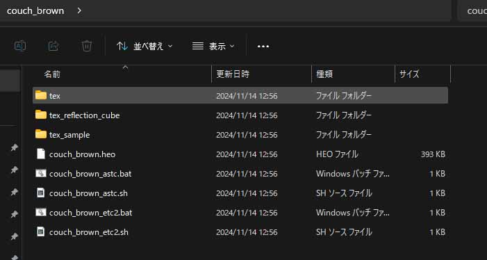

# アセットの再フォーマットとは

World Builderでは、自分自身で用意した3Dモデルを利用することができます。
使用することができる拡張子として、glbフォーマットと、heoフォーマットの二つがあります。

## 使用できる3Dフォーマットについて
### glbフォーマット
**glb**は、glTFという3Dモデルのファイルフォーマットの一つです。

ブラウザ上での3Dコンテンツの表示に適しており、Unity、Maya、Blenderなど、様々なツールで書き出すことが可能です。
ポリゴンモデルだけでなくテクスチャやマテリアルの情報を含むことができます。

glTFには、glbフォーマットと、gltfフォーマットの二つがありますが、World Builderで使用できるのは、glbフォーマットのみです。

!!! warning "8mb以上のglbは読み込めません"
    α版 v0.6時点にて、8mb以上のglbファイルをワールドに配置しようとすると、ワールドビルダーがフリーズします。
    
    お手数ですが、blenderなどでモデルの軽量化や、画像編集ソフトでのテクスチャの軽量化を行ってください。

!!! warning "glbファイルのコライダーはバウンディングボックスとなります"
    glbファイルのコライダーはバウンディングボックス（モデルにぴったりと被さる透明の箱のようなイメージ）として設定されます。
    
    現バージョンでは、MeshColliderへの変換は対応しておらず、コライダーの無効化を行うこともできません。

    バウンディングボックスではないコライダーを設定したい場合は、heoフォーマットでの書き出しを行ってください。heoフォーマットの書き出し方法については[こちら](./Reformatting3DModels/ExportingHEOUsingVketCloudSDK.md)をご覧ください。

### heoフォーマット
**heo**は、World Builderを動かしているVket Cloudという開発エンジンに適した3Dモデルのファイルフォーマットです。

glbフォーマットでは、細かい当たり判定の調整や、UVスクロールなどの設定はできませんが、heoフォーマットであれば、3Dモデルに細かな設定を行うことが可能です。

ただし、heoフォーマットを書き出すには、VketCloudSDKというUnityを用いた、Vket Cloudのワールドを開発するツールを使用する必要があります。

heoファイルをアップロードしたい場合は、

* ○○○_astc.bat
* ○○○_astc.sh
* ○○○_astc2.bat
* ○○○_astc2.sh
* ○○○.heo

以上の5つとそれらのテクスチャフォルダ等を配下に含むフォルダをアップロードウィンドウにて選択し、ウィンドウ下部の「フォルダーの選択」をクリックすることでインポートが可能となります。（各種ファイルについてはVketCloudSDKでheoファイルを書き出した際に必要なファイルが全て出力されます）
なお、フォルダ選択時には各拡張子のファイルは非表示となるためこれらがどのフォルダに含まれているかあらかじめ確認をしておく必要があります。

## 様々なツールでの書き出し方
以下の記事では、Blender、Unityを利用した、書き出し方を解説しています。

### Blender
#### glbフォーマット
[Blenderを利用して、GLBを書き出す](ExportingGLBUsingBlender.md)

### Unity
Unityでの事前準備として、以下の記事を参考に3Dモデルの準備を行ってください。

[Unityを利用する場合の準備](PreparationUnity.md)

#### glbフォーマット
[UnityでUniVRMを利用して、GLBを書き出す](ExportingGLBUsingUniVRM.md)

#### heoフォーマット
[UnityでVketCloudSDKを利用して、HEOを書き出す](ExportingHEOUsingVketCloudSDK.md)

