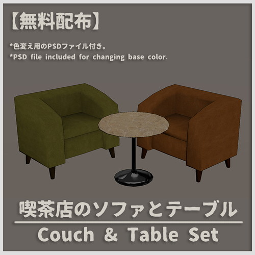
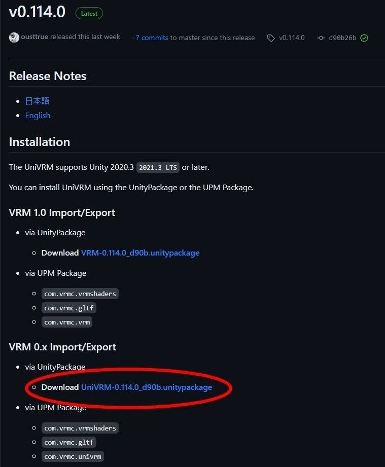
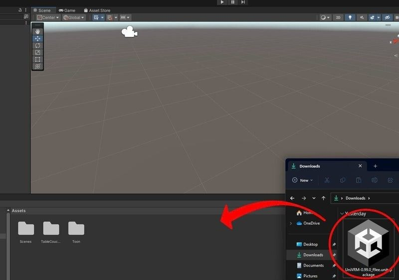
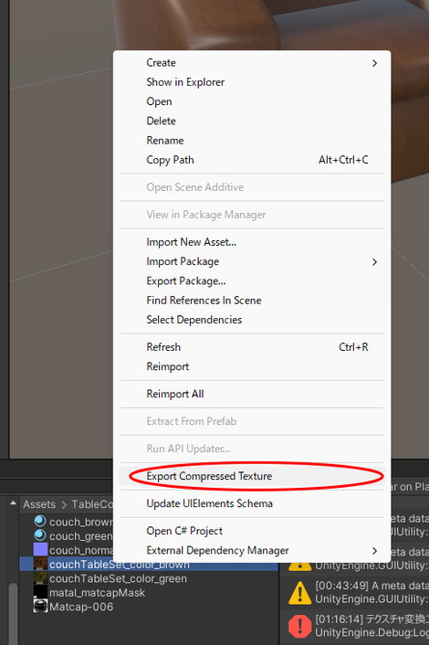

# アセットの再フォーマット

Scene Builderでは将来的にプリセットのアセットを多数用意して、そちらを使用することでワールドの作成を行えるようにする予定ですが、α版時点ではその機能が存在していないため、サンプルプロジェクトで配布している分のモデル以外のご自身のモデルを使用したい場合、

- UniVRMを使用してglbファイルを書き出す

- VketCloudSDKを使用してheoファイルを書き出す

のどちらかを行う必要があります。

ここでは、どちらの手順も記載しますので、ご自身にあったやり方で書き出していただけますと幸いです。

例として、今回は[Vket Storeで入手したモデル](https://store.vket.com/ja/items/7530){target=_blank}と、モデルに使用しているシェーダーをUnlitシェーダーに変換して、書き出しを行います。

[【無料配布】カフェのソファとテーブルセット【VRChat】](https://store.vket.com/ja/items/7530){target=_blank}

!!! note caution
    ※Scene Builderにモデルをアップロードする際は、モデルの利用ライセンスあるいはガイドライン等に違反していないか注意してください。

## 下準備：見た目の調整

### Unityでモデルを調整する

Unityプロジェクトを作成し、用意したモデルをUnityプロジェクトに導入し、シーン画面へとモデルのデータを投下します。

モデルのprefabファイルが用意されている場合はprefabを使用します。

本モデルの場合、シェーダーとしてUTS (UnitychanToonShader)が割り当てられています。
このまま各ファイルに変換してアップロードすることもできますが、Scene Builder上での見た目が暗くなる可能性があるため、**Unlit**シェーダーへと変換します。

### Unlitシェーダーへの変換

Unlitシェーダーへ使用しているシェーダーを変換することで、シーン上の直接光による光や影の影響を受けず、極端に明るくなったり、暗くなったりすることを回避することができます。

3Dモデルに割り当てられているシェーダーを変更するには、モデルを選択した上でインスペクター画面下のマテリアルからShaderの項目を変更します。
例として、以下の画像では「Unlit/Texture」を選択しマテリアルの設定を変更しています。

Unlitシェーダーへの変更によって、見た目が以下のように明るくなりました。

←Before     After→

見た目の調整が完了したら、各ファイルの出力を行います。

## UniVRMを使用してglbファイルを書き出す

UniVRMを使用したglbファイルへの変換では.fbx、.obj、.dae ([Collada](https://www.khronos.org/collada/){target=_blank})、そして.dxfファイルが[使用できます](https://docs.unity3d.com/ja/2022.3/Manual/3D-formats.html){target=_blank}。

### UniGLTF (UniVRMの導入)

はじめに、glbファイルを出力するための環境を用意します。
Blenderなどのモデリングソフトから直にglbファイルを出力することもできます。今回の場合は使用したいモデルがUnitypackageに格納されているため、マテリアルやサイズ調整の利便性を踏まえてUnityを使って作業します。

glbファイルへの変換を行うにあたって、VRM Consortiumが配布している[UniVRMパッケージ](https://github.com/vrm-c/UniVRM/releases){target=_blank}内の[UniGLTF](https://vrm.dev/gltf/index.html){target=_blank}を使用します。
VRMはglTF規格の拡張であるため、本ライブラリの導入によってUnityでのglbファイル出力が容易になります。

本ページ公開時点では最新のUniVRMが対応するUnityバージョンが2021.3LTS以降のため、本ページでは2022.3.8f1を使用しました。
UniVRMは[UnityPackageをダウンロードする](https://github.com/vrm-c/UniVRM/releases/tag/v0.114.0){target=_blank}か、UPMでパッケージを指定して導入します。

ダウンロードが完了したら、UnityPackageをエディター内にドラッグ＆ドロップしてインストールします。

インストールが完了したら、モデルをglbに変換します。

### モデルをglbで出力する

UniGLTFタブからExport to GLBを選択し、ファイルの出力を実行します。

モデルによりますが、Exporterの設定は特に変更せずに出力します。

これで、glbファイルの書き出しは完了です。

## VketCloudSDKを使用してheoファイルを書き出す

VketCloudSDKを使用したheoファイル変換では、.fbxファイルが使用できます。

### VketCloudSDKの導入

はじめに、heoファイルを出力するための環境を用意します。

heoファイルとは、Vket Cloudエンジン独自の3Dモデルの規格であり、出力するには、Vket Cloud SDKが導入されたUnity Projectが必要になります。

Vket Cloud SDKの導入には、Vket Accountへの登録と、ライセンスIDへの登録が必要です。VketCloudSDK Manualの[はじめに - VketCloudSDK Manual](https://vrhikky.github.io/VketCloudSDK_Documents/latest/ja/index.html){target=_blank} を参照しながら、SDKにログインするまでの手順を行って下さい。

本ページ公開時点では最新のUniVRMが対応するUnityバージョンが2019.4.31f1のため、本ページでは2019.4.31f1を使用しました。

インストールが完了したら、モデルをheoに変換します。

### モデルをheoで出力する

出力を行う前に、heoファイルはpng画像のテクスチャしか使用できないため、変換を行います。

使用されているテクスチャを選択し、Export Compressed Textureを行うことで、png画像が出力され、変換完了後に出てくるウインドウにてOKを押すと自動的に参照先のテクスチャが切り替わります。

データの整理が終わったら、**VketCloudSDKタブからExport Field**を選択し、ファイルの出力を実行します。

この時、TransformのPositionとRotationがすべて0であることを確認してください。

そうでないとScene Builderで配置したときに意図しない場所に設置されることがあります。

複数のファイルが書き出されるため、モデルと同じ名称のフォルダを作成して、そこを選択することで、一つのフォルダとして書き出した方がScene Builderに配置しやすくなります。

これで、heoファイルの書き出しは完了です。
