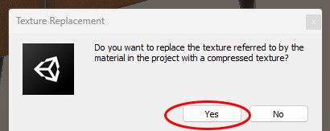
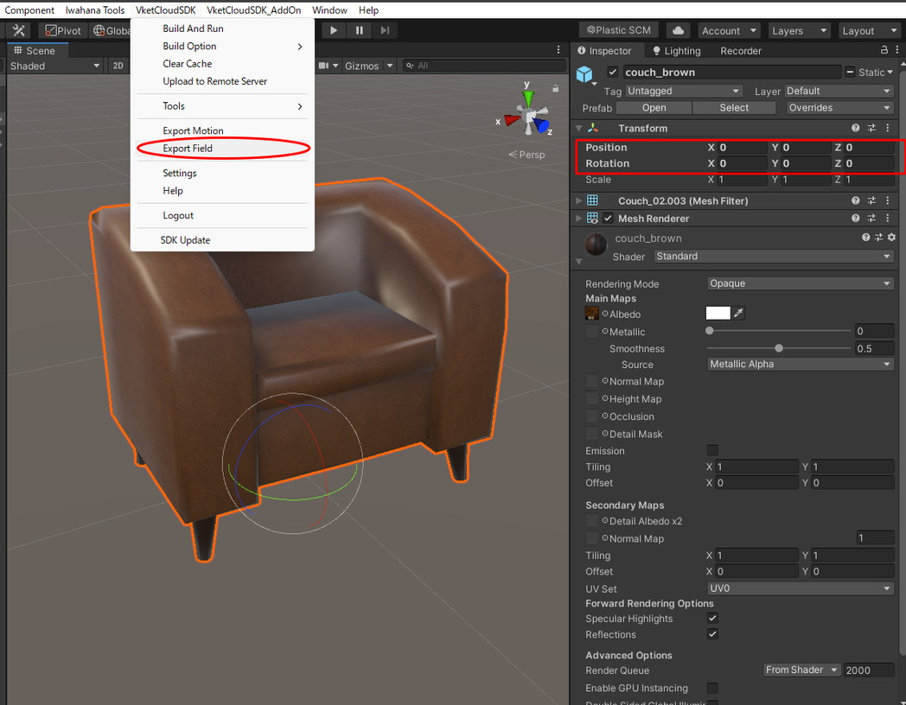
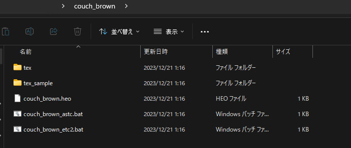

# VketCloudSDKを使用してheoファイルを書き出す

VketCloudSDKを使用したheoファイル変換では、.fbxファイルが使用できます。

### VketCloudSDKの導入

はじめに、heoファイルを出力するための環境を用意します。

heoファイルとは、Vket Cloudエンジン独自の3Dモデルの規格であり、出力するには、Vket Cloud SDKが導入されたUnity Projectが必要になります。

VketCloudSDKの導入には、Vket Accountへの登録と、ライセンスIDへの登録が必要です。VketCloudSDK Manualの[はじめに - VketCloudSDK Manual](https://vrhikky.github.io/VketCloudSDK_Documents/latest/ja/index.html){target=_blank} を参照しながら、SDKにログインするまでの手順を行って下さい。

本ページ公開時点では最新のUniVRMが対応するUnityバージョンが2019.4.31f1のため、本ページでは2019.4.31f1を使用しました。

インストールが完了したら、モデルをheoに変換します。

### モデルをheoで出力する

出力を行う前に、heoファイルはpng画像のテクスチャしか使用できないため、変換を行います。

使用されているテクスチャを選択し、Export Compressed Textureを行うことで、png画像が出力され、変換完了後に出てくるウインドウにてOKを押すと自動的に参照先のテクスチャが切り替わります。

データの整理が終わったら、**VketCloudSDKタブからExport Field**を選択し、ファイルの出力を実行します。

この時、TransformのPositionとRotationがすべて0であることを確認してください。

そうでないとWorld Builderで配置したときに意図しない場所に設置されることがあります。

複数のファイルが書き出されるため、モデルと同じ名称のフォルダを作成して、そこを選択することで、一つのフォルダとして書き出した方がWorld Builderに配置しやすくなります。

これで、heoファイルの書き出しは完了です。
