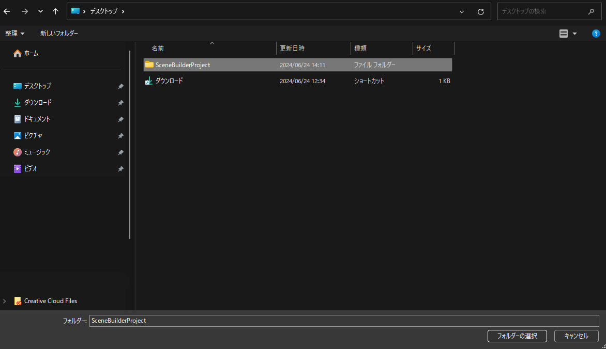
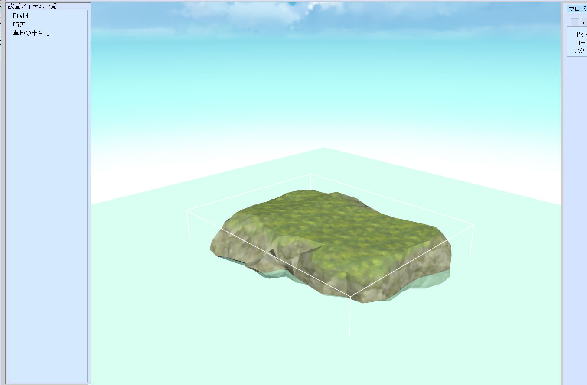

# 編集中のワールドを保存する方法

編集中のワールドを保存することで、World Builderで作業した内容を保存することができます。保存した編集中のワールドを読み込むことで、作業を再開することができます。
World Builderでは、VketCloudのワールドに紐づけて、編集中のワールド保存する方法と、PCに編集中のワールドを保存する方法の二つが存在しますが、ここではVketCloudのワールドに紐づける方法を説明します。

## VketCloudのワールドのワールドに紐づける方法

### ライセンスIDの登録を行う

編集中のワールドを、VketCloudのワールドに紐づけるには、Vketアカウントの作成と、VketCloudサイトでのライセンスIDの登録が必要です。

まだVketAccountと、ライセンスIDをお持ちでない方は、以下の手順に従い、ライセンス登録を実施してください。

[アカウント準備](SetupAccount.md)

## ワールドを作成する

### 編集中のワールドを保存する

シーンパネルでシーンの編集を行なったのち、**メニュー > ワールドを保存**をクリックします。

new scene projectをクリックします。

### 編集中のワールドを開く

一度ワールドを保存したら、次回以降、[VketCloud公式サイト](https://cloud.vket.com/)からワールドビルダーに移動したときに、前回保存したワールドを開いて編集を続けることができます。

ワールドビルダーで作成/更新を押下します。

プロジェクトを選択するモーダルが表示されるので、開きたい編集中のワールドで、利用しているプロジェクトを選択します。

!!! warning "利用していないプロジェクトを選択した場合"
    プリセットアセット以外のモデルや画像、HeliScriptを作成して利用していた場合、読み込むべきファイルが見つからずに編集ができなくなります。
    必ずプロジェクトは同じものを開くようにしてください。

しばらく待つと、前回保存した内容が、自動的に立ち上がります。

