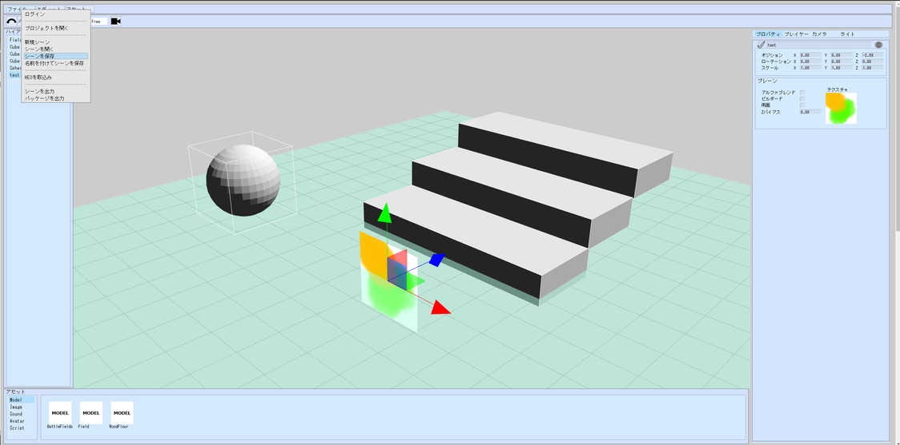
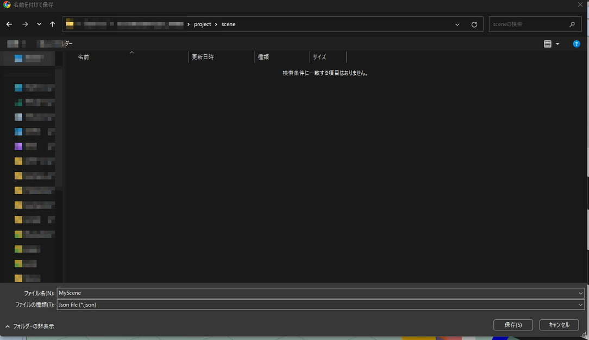
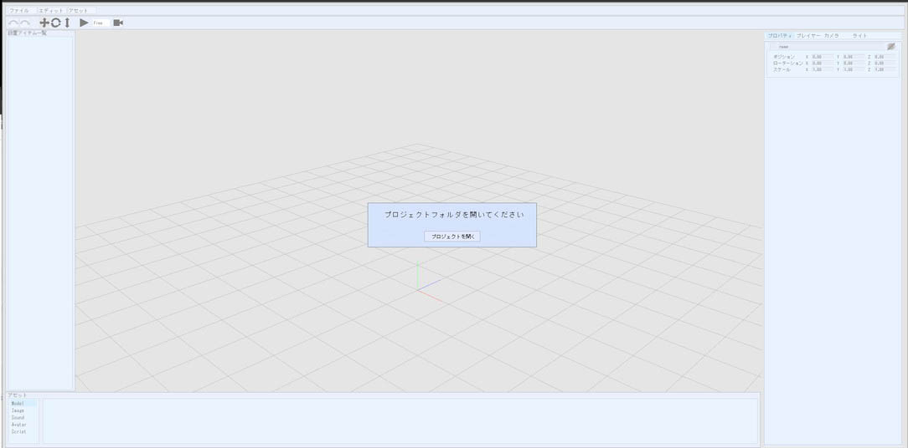
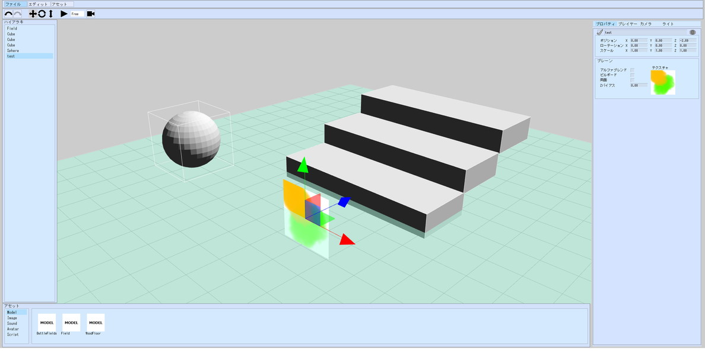

# 編集中のワールドを保存する方法

編集中のワールドを保存することで、World Builderで作業した内容を保存することができます。保存した編集中のワールドを読み込むことで、作業を再開することができます。
World Builderでは、VketCloudのワールドに紐づけて、編集中のワールド保存する方法と、PCに編集中のワールドを保存する方法の二つが存在します

## VketCloudのワールドのワールドに紐づける方法

### 編集中のワールドを保存する
### ライセンスIDの登録を行う

編集中のワールドを、VketCloudのワールドに紐づけるには、Vketアカウントの作成と、VketCloudサイトでのライセンスIDの登録が必要です。

まだVketAccountと、ライセンスIDをお持ちでない方は、以下の手順に従い、ライセンス登録を実施してください。

[アカウント準備](GettingStarted/SetupAccount.md)

## ワールドを作成する

### 編集中のワールドを保存する

シーンパネルでシーンの編集を行なったのち、**メニュー > ワールドを保存**をクリックします。

保存したいワールドが含まれている、チーム名を選択します。

保存したいワールドを選択します

新しく編集中のワールドを保存します。既存の編集中のワールドを上書きしたい場合は、**新しい編集中のワールドを保存**をクリックします

### 編集中のワールドを開く

**ファイル > ワールドを開く**から、前回保存したシーンまでのフォルダを開くと保存していたシーンを再開することができます。

開きたい編集中のワールドが含まれている、チーム名を選択します。

開きたい編集中のワールドが含まれている、ワールドを選択します

開きたい編集中のワールドを選択します。

## PCにデータを保存する方法

### 編集中のワールドを保存する

シーンパネルでシーンの編集を行なったのち、**メニュー > PCにワールドを保存**をクリックします。

エクスプローラーが開き、シーンを保存することができるようになるので、自身のプロジェクト/project/sceneフォルダに移動し、任意の名前を入力して保存します。

これで、現在のシーンの作業状況が保存されたため、World Builderのタブを閉じても作業を再開することができます。

### プロジェクトを開く

World Builderを開きなおすと、再度どのプロジェクトを開くの確認ウィンドウが表示されるので、シーンを保存したプロジェクトを選択し、プロジェクトを開きます。

### 編集中のワールドを開く

**ファイル > PCにワールドを開く**から、前回保存したシーンまでのフォルダを開くと保存していたシーンを再開することができます。

