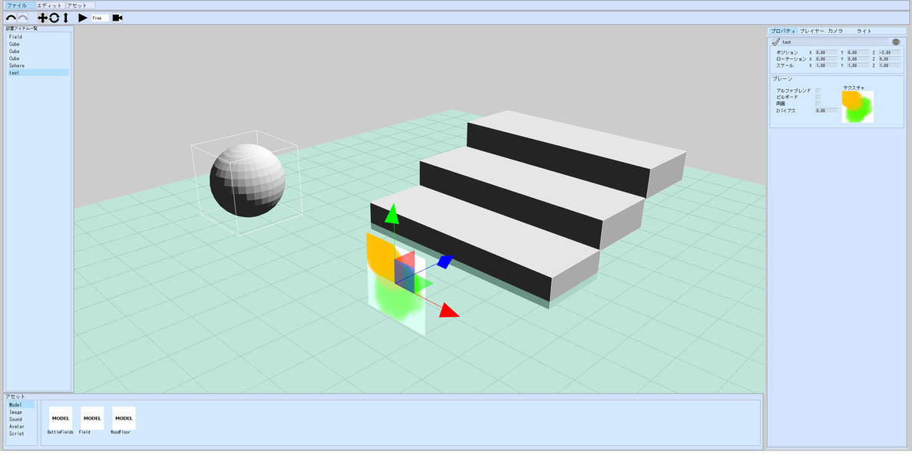

# シーンを保存する方法

シーンを保存することで、シーンビルダーで作業した内容を保存することができます。保存したファイルを読み込むことで、作業を再開することができます。

## シーンを保存する

シーンパネルでシーンの編集を行なったのち、**ファイル > シーンを保存**をクリックします。

エクスプローラーが開き、シーンを保存することができるようになるので、自身のプロジェクト/project/sceneフォルダに移動し、任意の名前を入力して保存します。

これで、現在のシーンの作業状況が保存されたため、Scene Builderのタブを閉じても作業を再開することができます。

## プロジェクトを開く

シーンビルダーを開きなおすと、再度どのプロジェクトを開くの確認ウィンドウが表示されるので、シーンを保存したプロジェクトを選択し、プロジェクトを開きます。

## シーンを開く

**ファイル > シーンを開く**から、前回保存したシーンまでのフォルダを開くと保存していたシーンを再開することができます。

