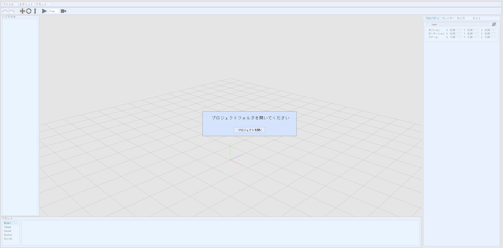
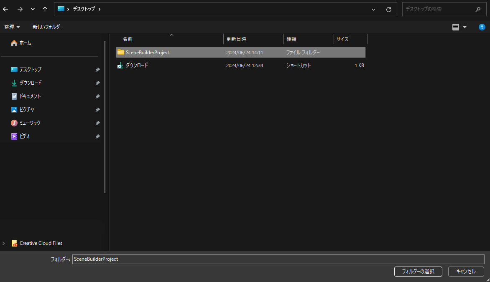
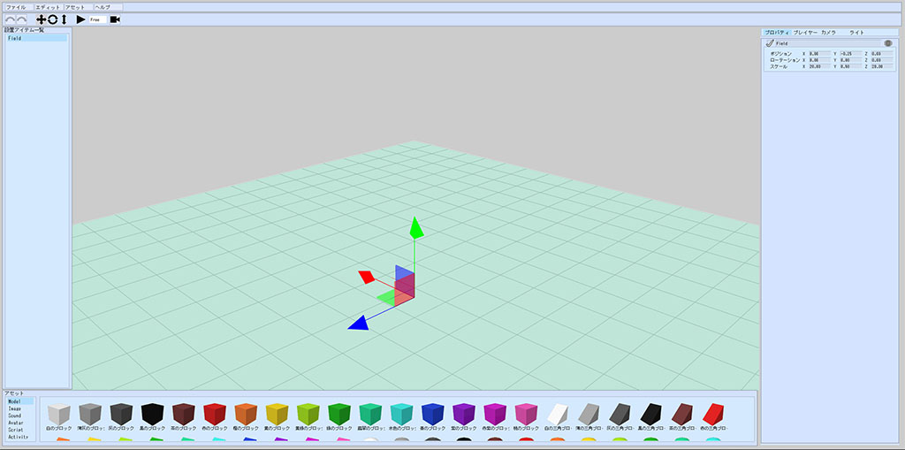

# SceneBuilderのセットアップ

## Scene Builder(α)のURLにアクセスする

以下のURLにアクセスします。

[https://scenebuilder.vket.com/](https://scenebuilder.vket.com/){target=_blank}

## プロジェクトを開く

Scene Builder(α)が開けたら、どのプロジェクトを開くか問われます。

プロジェクトを開くボタンを押すと、フォルダ選択ダイアログが開かれるので、任意の場所に新しいフォルダを作ります

アセットパネルのModelにプリセットのモデルが複数個表示されていれば成功です。

