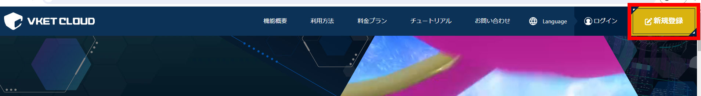
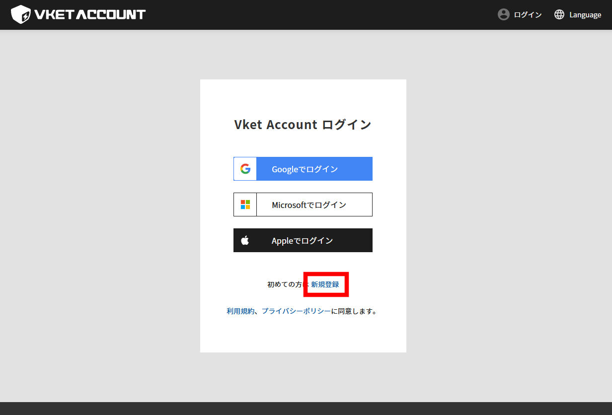
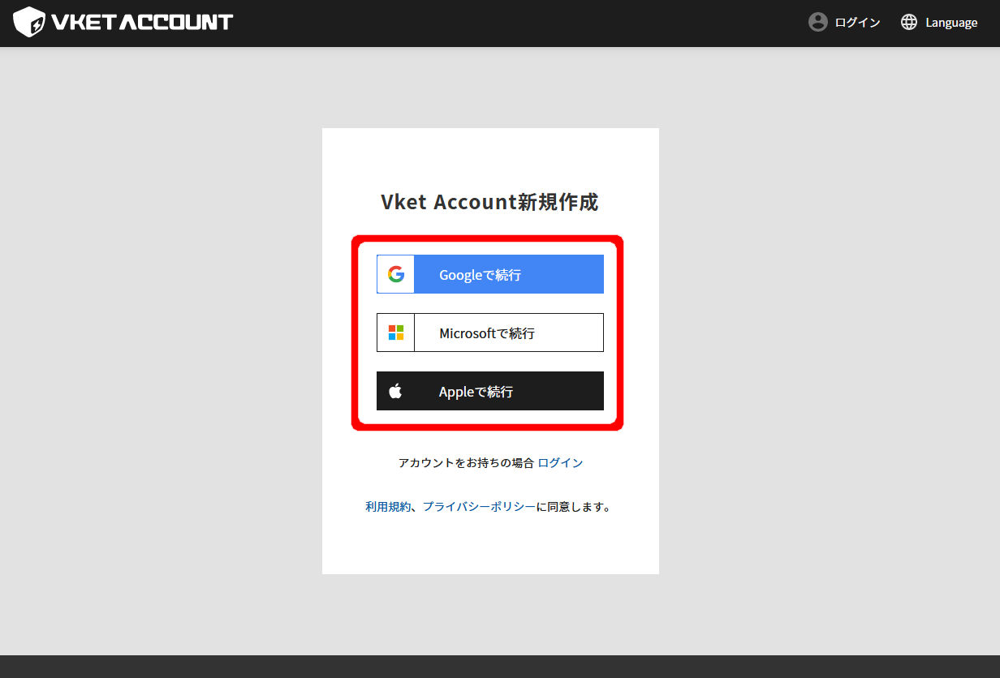
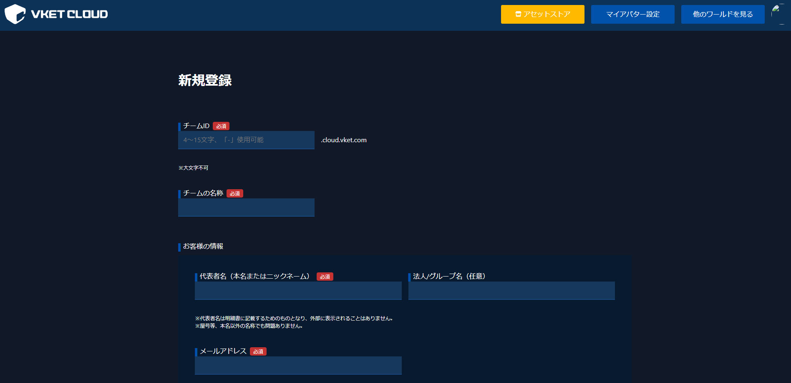

# アカウント準備

## Vketアカウント登録

World Builderでワールドアップロード機能や、サーバー上へ編集中のワールドを保存する機能などを利用するには、Vketアカウントの作成と、VketCloudサイトでのライセンスIDの登録が必要です。

まだVketAccountと、ライセンスIDをお持ちでない方は、以下の手順に従い、ライセンス登録を実施してください。

1. Vket Cloud公式サイト（[https://cloud.vket.com](https://cloud.vket.com/)）にアクセスし、右上の「新規登録」ボタンを押してください。

    

1. ログイン画面が表示されますので、「新規登録」ボタンを押します。

    

1. Vketアカウントと紐付けたい任意のアカウントを選択し、アカウントの連携を行ってください。

    

## ライセンスID登録

1. Vketアカウントの連携が完了後、再びトップページに戻ったのち「ログイン」を押すと、Vket Cloudの新規登録画面へ遷移します。
以下の情報を入力する事で登録が完了します。

    - チームID
    - チームの名称
    - 代表者名(姓名)
    - メールアドレス
    - 国・地域
    - 種別(個人/法人)

    
