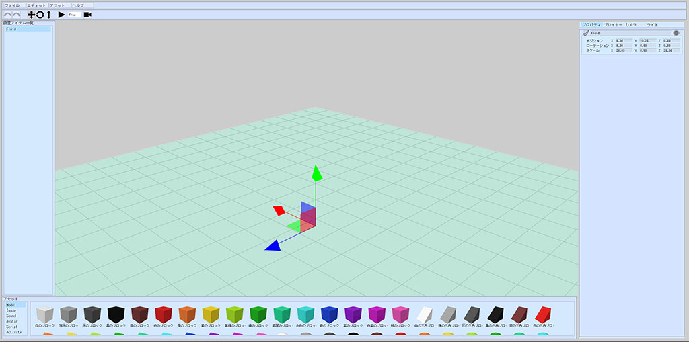

# World Builderのセットアップ

## World BuilderのURLにアクセスする

以下のURLにアクセスします。

[https://scenebuilder.vket.com/](https://scenebuilder.vket.com/){target=_blank}

## プロジェクトを開く

World Builderが開けたら、どのプロジェクトを開くか問われます。

プロジェクトを開くボタンを押すと、フォルダ選択ダイアログが開かれるので、任意の場所に新しいフォルダを作ります

モーダルの表示が消え、操作ができるようになったら成功です

