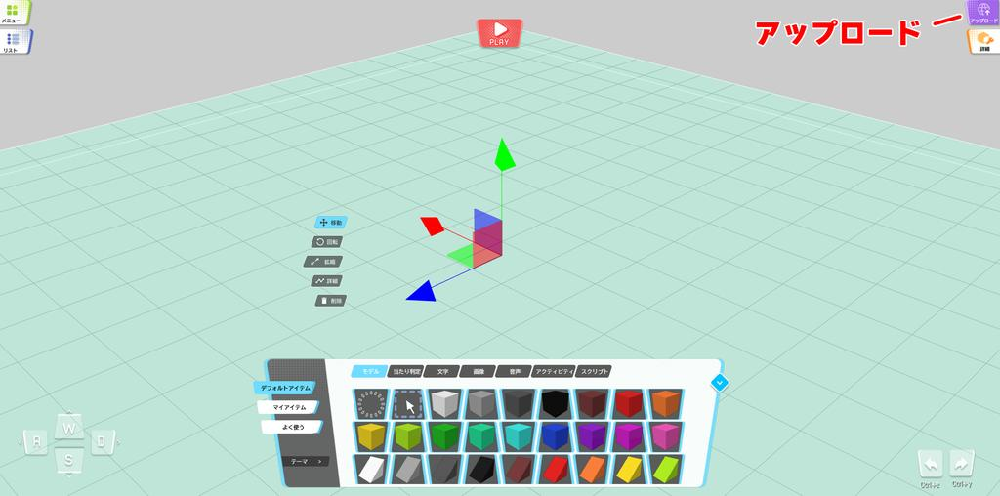
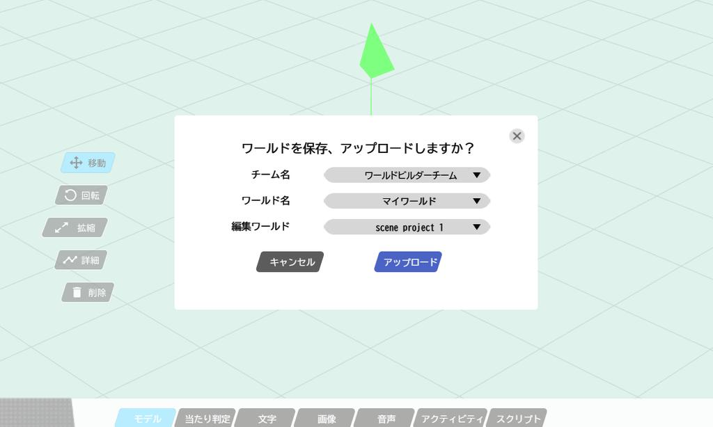
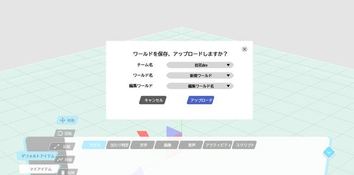
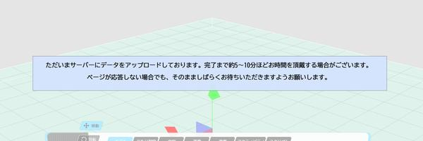
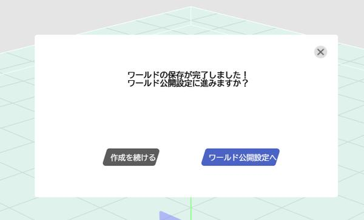
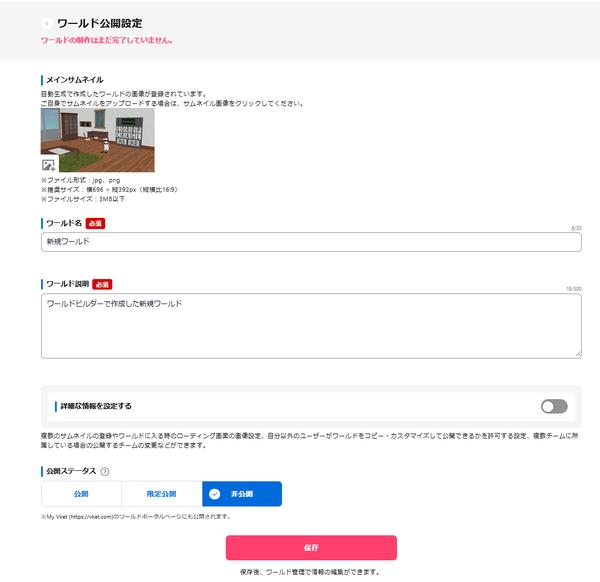
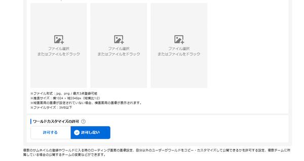
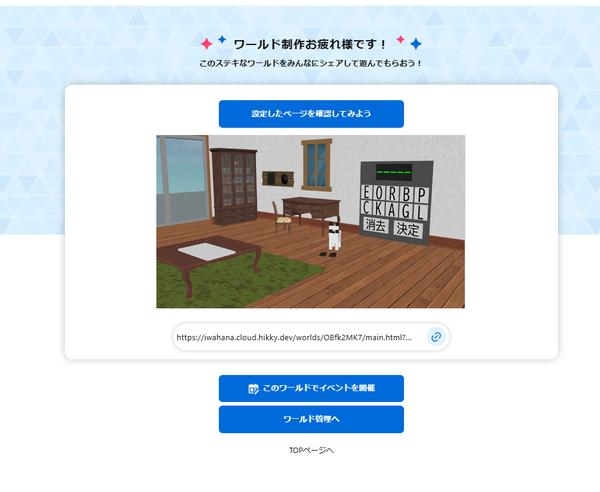

# ワールドをアップロードする

World Builderでワールドを作成したら、[VketCloud公式サイト](https://cloud.vket.com/)や、[My Vket](https://vket.com/play/world)にワールドを公開することができます。

アップロードしたワールドは、URLを共有することで別の人とワールドを見て回ることが可能です。

## ワールドをアップロードする前に

Vket Cloud公式サイト（[https://cloud.vket.com](https://cloud.vket.com/)）でVketAccountを登録する必要があります。

事前に下記の手順からVketAccountを作成してください。

1. [アカウント準備](SetupAccount.md)

## ワールドアップロード時の仕様制限について

ワールドのデータが多すぎると、訪れた人によっては、ワールドに入ることができなくなることがあります。

[こちら](.\VketCloudGuidelines.md)のページをもとに、作成したワールドのデータを確認することで、より多くの人に自分が作成したワールドを遊んでもらうことができるようになります。

## ワールドアップロード

ワールドのアップロードを行うには、**アップロード** ボタンを押します。

アップロード先のワールドが問題ないか確認するモーダルが表示されるので、問題なければ**アップロード**を押します。

この時、ワールドの設定で、新規ワールドを選ぶと、既存のワールドではなく、新しいワールドとして、保存することができます。

アップロード中のモーダルが出現します。

この間、World Builderのタブを

- 閉じる

- 最小化する

- 他のウインドウを最大化して、World Builderのタブを完全に隠す

といった操作を行わないようにしてください。アップロードが途中で中断、もしくは、アップロード機能が正常に進まない可能性があります。

## ワールドを開く

ワールドのアップロードが完了すると、完了モーダルが表示されいます。

ワールド公開設定ページに遷移すると、ワールドの詳細設定を行うことができます。

!!! ワールド公開設定について
    詳細にあるワールド公開設定を有効にすると、他のユーザーが、アップロードしたワールドをカスタマイズして使うことができるようになります。
    カスタマイズを許可したくない場合は、この設定をオフにしてください。
    

保存ボタンを押すことで、ワールドの設定を保存することができます。ワールドプレビューページで、アップロードを行ったワールドのワールドの確認や、SNSでのシェアが行えます。

