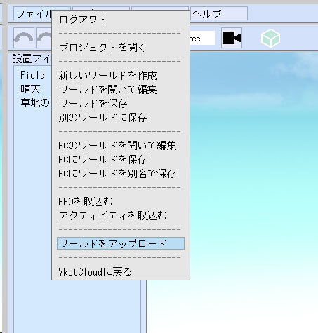
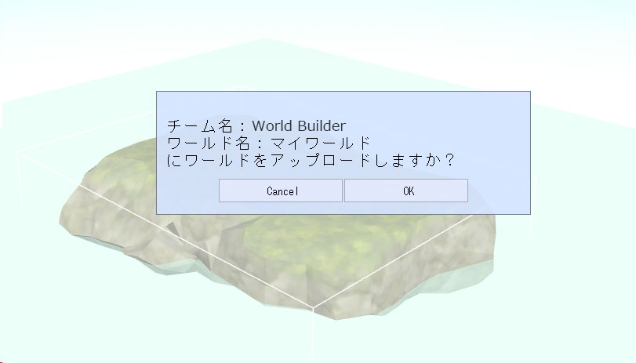
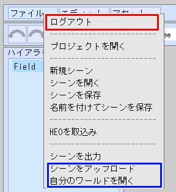
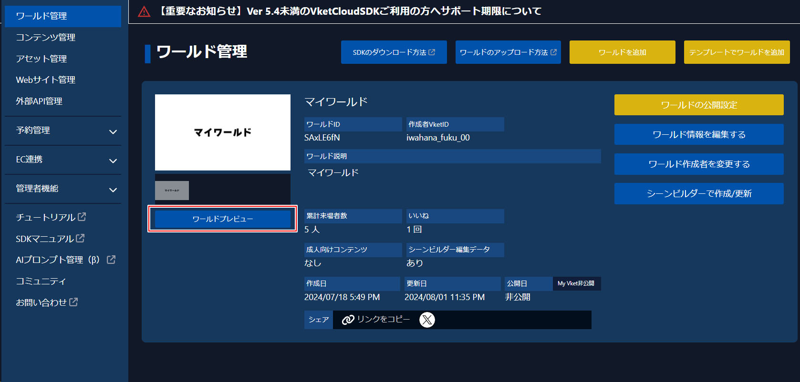

# ワールドをアップロードする

World Builderでワールドを作成したら、[My Vket](https://vket.com/play/world)にワールドを公開することができます。

アップロードしたワールドは、URLを共有することで別の人とワールドを見て回ることが可能です。

## ワールドをアップロードする前に

Vket Cloud公式サイト（[https://cloud.vket.com](https://cloud.vket.com/)）でワールドを登録する必要があります。

事前に下記の手順からワールドを登録してから、World Builderにアクセスしてください。

1. [アカウント準備](SetupAccount.md)

1. [ワールドの作成](CreateWorld.md)
    

## ワールドアップロード

シーンのアップロードを行うには、**ワールドをアップロード** ボタンを押します。

アップロード先のワールドが問題ないか確認するモーダルが表示されるので、問題なければOKボタンを押します

「ワールドをアップロードしています...」といったモーダルが出現します。このアップロード作業は、数分～数十分かかる可能性がございます。

この間、World Builderのタブを

- 閉じる

- 最小化する

- 他のウインドウを最大化して、World Builderのタブを完全に隠す

といった操作を行わないようにしてください。アップロードが途中で中断、もしくは、アップロード機能が正常に進まない可能性がございます。

## ワールドを開く

「ワールドをアップロードしています...」といったモーダルが閉じられると、World Builderでのワールドアップロード作業が終了しています。

[VketCloud公式サイトのワールド管理ページ](https://cloud.vket.com/account/world)にて、アップロードを行ったワールドのワールドプレビューボタンを押すと、アップロードされたワールドを確認することができるようになります。

!!! warning "アップロードにかかる時間について"
    World Builderでのワールドアップロード作業が終わったのち、ワールドプレビューボタンが有効になるまで数分～数十分かかる可能性がございます。

    こちらは正常な動作となっておりますので、お手数おかけいたしますがワールドのアップロードが終了するまで、お待ちいただけますと幸いです。
