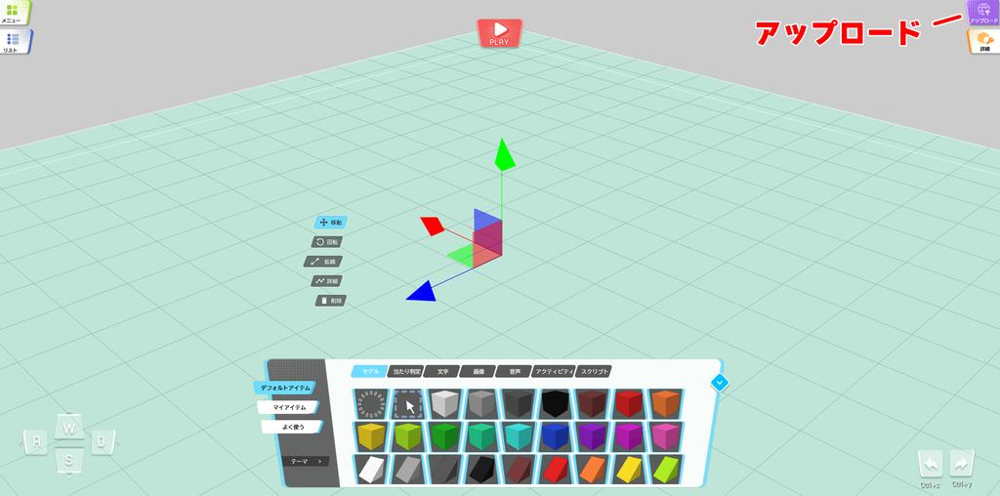
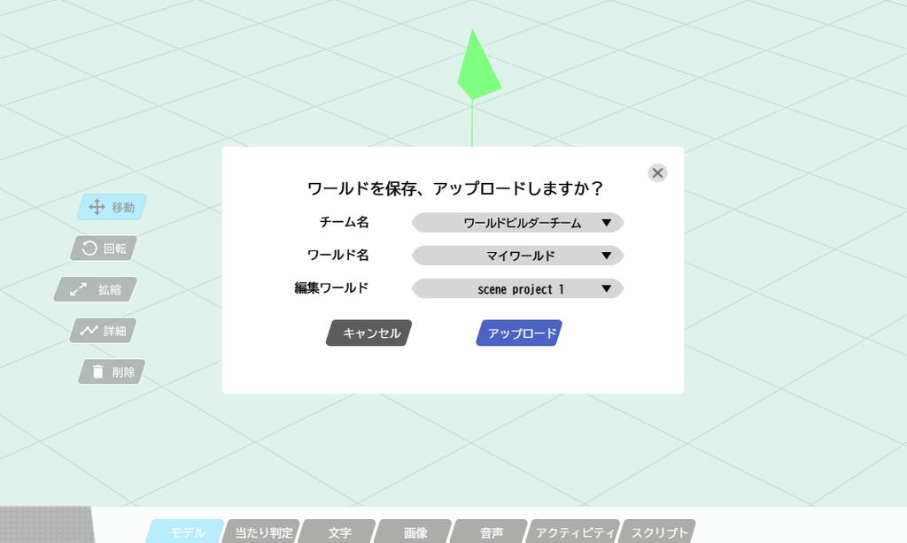
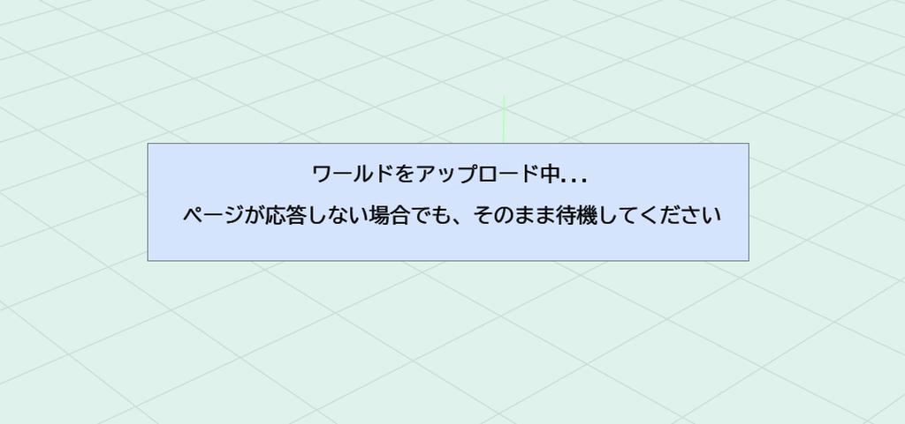
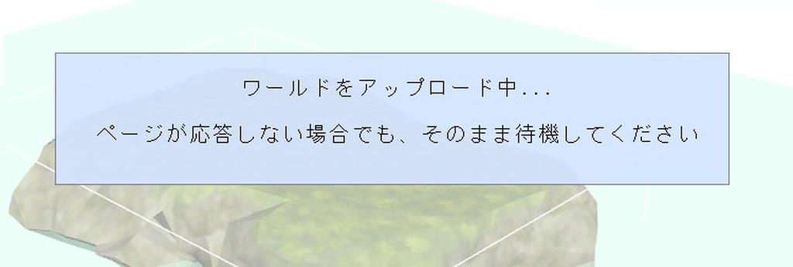

# ワールドをアップロードする

World Builderでワールドを作成したら、[My Vket](https://vket.com/play/world)にワールドを公開することができます。

アップロードしたワールドは、URLを共有することで別の人とワールドを見て回ることが可能です。

## ワールドをアップロードする前に

Vket Cloud公式サイト（[https://cloud.vket.com](https://cloud.vket.com/)）でVketAccountを登録する必要があります。

事前に下記の手順からVketAccountを作成してください。

1. [アカウント準備](SetupAccount.md)    

## ワールドアップロード

ワールドのアップロードを行うには、**アップロード** ボタンを押します。

アップロード先のワールドが問題ないか確認するモーダルが表示されるので、問題なければOKボタンを押します

この時、ワールドの設定で、新規ワールドを選ぶと、既存のワールドではなく、新しいワールドとして、保存することができます

「ワールドをアップロードしています...」といったモーダルが出現します。このアップロード作業は、数分～数十分かかる可能性がございます。

この間、World Builderのタブを

- 閉じる

- 最小化する

- 他のウインドウを最大化して、World Builderのタブを完全に隠す

といった操作を行わないようにしてください。アップロードが途中で中断、もしくは、アップロード機能が正常に進まない可能性がございます。

## ワールドを開く

ワールドのアップロードが完了すると、完了モーダルが表示されいます。

ワールド公開設定ページに遷移すると、ワールドの詳細設定を行うことができます。

!!! ワールド公開設定について
    詳細にあるワールド公開設定を有効にすると、他のユーザーが、アップロードしたワールドをカスタマイズして使うことができるようになります。
    カスタマイズを許可したくない場合は、この設定をオフにしてください。
    

保存ボタンを押すことで、ワールドの設定を保存することができます。ワールドプレビューページで、アップロードを行ったワールドのワールドの確認や、SNSでのシェアが行えます。

!!! warning "アップロードにかかる時間について"
    World Builderでのワールドアップロード作業が終わったのち、ワールドプレビューボタンが有効になるまで数分～数十分かかる可能性がございます。

    こちらは正常な動作となっておりますので、お手数おかけいたしますがワールドのアップロードが終了するまで、お待ちいただけますと幸いです。
