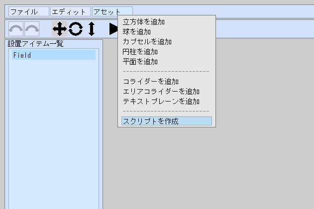
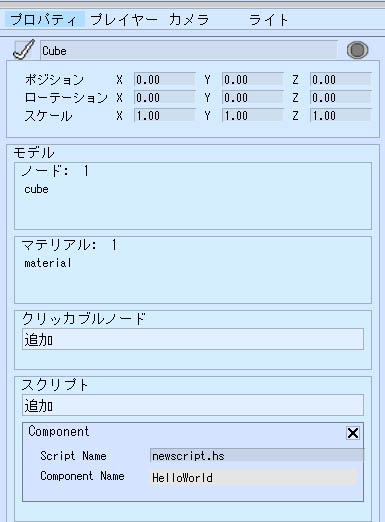
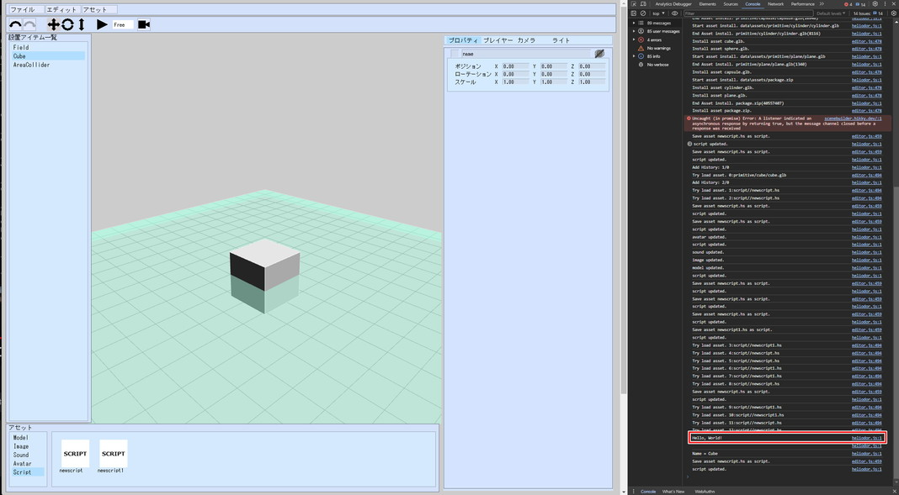

# HeliScript概要

Vket Cloudでは、HeliScriptというエンジン独自のスクリプトを使用してプログラミングを行うことができます。  
HeliScriptを使用すると、[アクション](../Actions/ActionsOverview.md)と比べてより複雑なギミック・挙動を実装できます。

HeliScriptの文法については[基本系](./hs_var.md)から順番に読むことで習得できます。  
また、ここでは以下にてHello Worldを出力する方法を通じて、基本的な実装の例を示します。

## HeliScriptの使い方の例 (Hello Worldをコンソールに出力する)

### 1\. アセットにHeliScriptファイルを追加する



初めに、HeliScriptを書き込むファイルを作ります。  
アセットメニューからスクリプトを作成を選択することで、アセットパネルのScriptにnewscriptという.hsファイルが追加されます。


### 2\. スクリプトをシーンに追加する

HeliScriptファイルを追加したら、次はシーンにHeliScriptの設定を行います。 HeliScriptは

- 設置アイテム一覧パネルに設置された、Modelのプロパティに存在するスクリプト欄

- 設置アイテム一覧パネルに設置された、エリアコライダーのプロパティに存在するスクリプト欄

に、スクリプトの名前と、そのスクリプトのコンポーネント名を設定することで、作成したHeliscriptが使用できるようになります。



### 4\. HeliScriptを書く

いよいよHeliScript本体を書いていきます。  
HelloWorld.hsの実装として以下に例を示します。

```
component HelloWorld {   
    //コンストラクタ関数：ワールド入場時に一度だけ実行されます
    public HelloWorld()
    {
        //コンソールに出力
        hsSystemWriteLine("Hello, World!\n");
    }

    //アップデート関数：毎フレーム実行されます
    public void Update()
    {

    }
}
```

### 5\. 再生してテストする

コードの実装を完了した上で、メニュー左上から再生ボタンを押下しシーンを再生します。

ブラウザのデベロッパーツール（開発者ツール）を開くと、コンソールにHello, World!と出力されていることが確認できます。



## Player / Item / Nodeについて

Vket Cloud独自の概念として、Player, Item, そしてNodeがあります。  
以下にて各概念の概要を解説します。

## Player

Vket Cloudにおいて、Playerはワールド内の操作主体である自身を指します。  

PlayerのHeliScriptでの取り扱いは[Playerクラス](./hs_class_player.md)をご参照ください。

## Item

Vket Cloud上でワールドを構成する際、Player以外の各要素はItemとして表現されます。  
SceneBuilderではハイアラキにて配置されたキューブ、Field、コライダーなどのアイテムがこれにあたります。

ItemのHeliScriptでの取り扱いは[Itemクラス](./hs_class_item.md)をご参照ください。

## Node

前述のItemにノードとして子オブジェクトがある場合、その子オブジェクトはHeliScript上でもItemのNodeとして扱われます。  

NodeのHeliScriptでの取り扱いは[Itemクラス](./hs_class_item.md)をご参照ください。
