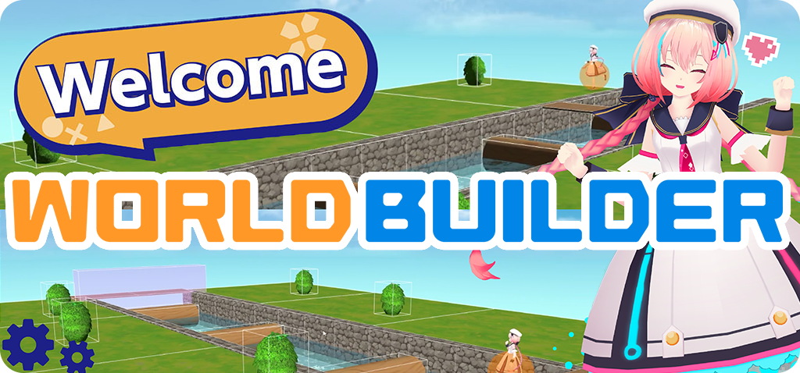
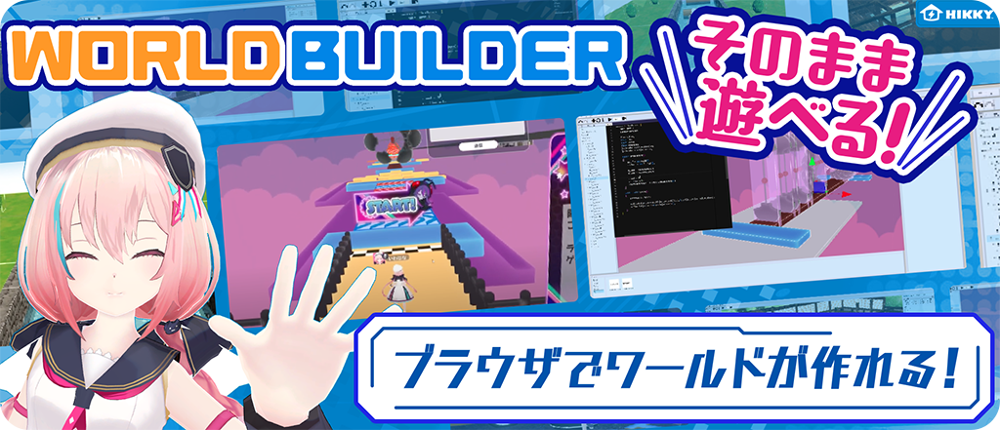

# **World Builder** マニュアルへようこそ！

## World Builderとは

**World Builder**は、Webブラウザだけ動作するVket Cloudのコンテンツ・ワールド制作のための開発キットです。

World Builderで3D空間を制作することで、特別なアプリのインストールや機器の用意をすることなく、ブラウザだけ他のユーザーと交流したり、コンテンツを楽しむことが出来る空間を自分の手で作ることが出来ます。

 

## さあ、はじめましょう！

World Builderを使ってみるには、下記リンクのウェブサイトに遷移するだけで使い始めることが出来るようになります。

**[{.link}](https://scenebuilder.vket.com/)**

また、[VketCloud公式サイト](https://cloud.vket.com/)で、ワールドを登録することで、自分のワールドを公開してランキングに乗せることができるようになります！

 

## より詳しく操作方法を知りたくなった時は
より詳しくWorld Builderの使い方を知りたくなった時や、ワールドのアップロードを行ないたくなった時は下記リンクを確認してみましょう。

### World Builderの基本

1. [アカウント準備](GettingStarted/SetupAccount.md)

1. [ワールドの作成](GettingStarted/CreateWorld.md)

1. [編集中のワールドを保存する](GettingStarted/SavingEditingWorlds.md)

1. [アセットの再フォーマット](GettingStarted/ReformattingAssets.md)

1. [アイテムの読み込み・配置](GettingStarted/ImportItems.md)

1. [ギミックを作成する](GettingStarted/CreateGimmicks.md)

1. [ワールドをアップロードする](GettingStarted/WorldUpload.md)

### 各種操作・設定

- [各ウィンドウの機能](ControlsProperties/WindowOverview.md)

- [マニピュレーターの操作方法](ControlsProperties/Manipulator.md)

- [カメラの操作方法](ControlsProperties/CameraControls.md)

- [アイテムごとのプロパティ](ControlsProperties/ItemConfig.md)

 

## 質問・要望・バグ報告について

質問、要望、バグ報告については[VketCloud/MyVket discordサーバー](https://discord.com/invite/wJjtZRKjqU){target=_blank}のチャンネルにてお願いいたします！
よりよいサービスとするため、皆様のご意見お待ちしております

また、World Builderの仕様は、サービス改善のため予告なく変更することがあります。ご了承のほどよろしくお願いいたします。

 
 

## Vket Cloudについて
World Builderは、Vket Cloudという誰もが自分だけのメタバースを作成し利用できるメタバース開発エンジンによって開発されています。
Vket Cloudの利用については、下記リンクのウェブサイトをご覧ください。

**[{.link}](https://cloud.vket.com/#about)**

 

## VketCloudSDKについて

Vket Cloudのコンテンツ・ワールド制作のための開発キットとして、Unityで動作するVketCloudSDKを使った開発を行うことが出来ます。
VketCloudSDKでは、Unityを扱えるユーザーにとってさらに多くの機能と複雑な実装のためのサポートツールが搭載されています。
VketCloudSDKを使ってみたい方は、下のリンクからVketCloudSDKマニュアルをチェックしてみてください

[VketCloudSDKマニュアル](https://vrhikky.github.io/VketCloudSDK_Documents/latest/ja/index.html){target=blank}    
