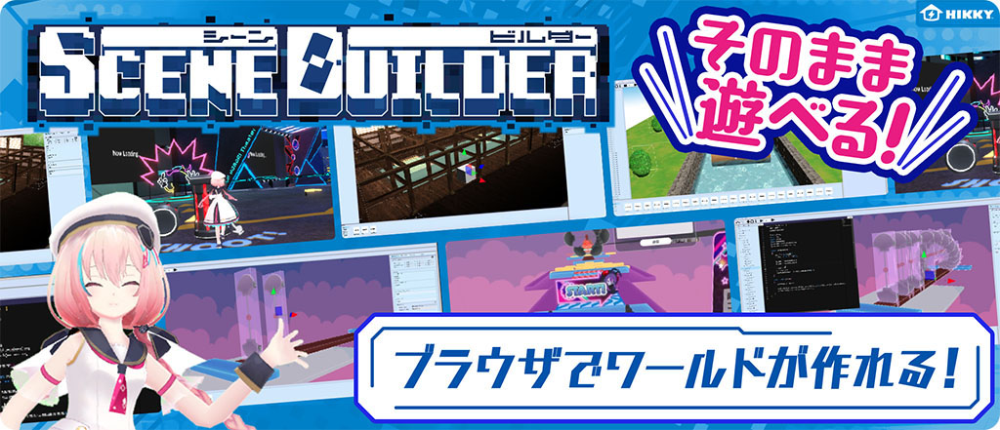

# Scene Builderマニュアルへようこそ！

## Scene Builderとは

**<ruby>Scene<rt>シーン</rt></ruby> <ruby>Builder<rt>ビルダー</rt></ruby>**は、<ruby>Web<rt></rt>ウェブ</ruby>ブラウザだけ動作する<ruby>Vket<rt>ブイケット</rt></ruby> <ruby>Cloud<rt>クラウド</rt></ruby>のコンテンツ・ワールド<ruby>制作<rt>せいさく</rt></ruby>のための開発</ruby>キットです。

<ruby>Scene<rt>シーン</rt></ruby> <ruby>Builder<rt>ビルダー</rt></ruby>で3D空間を<ruby>制作<rt>せいさく</rt></ruby>することで、特別なアプリのインストールや機器の用意をすることなく、ブラウザだけ他のユーザーと交流したり、コンテンツを楽しむことが<ruby>出来<rt>でき</rt></ruby>る空間を自分の手で作ることが<ruby>出来<rt>でき</rt></ruby>ます。

## さあ、はじめましょう！

<ruby>Scene<rt>シーン</rt></ruby> <ruby>Builder<rt>ビルダー</rt></ruby>を<ruby>使<rt>つか</rt></ruby>ってみるには、<ruby>下記<rt>かき</rt></ruby>リンクのウェブサイトに<ruby>遷移<rt>せんい</rt></ruby>するだけで<ruby>使<rt>つか</rt></ruby>い<ruby>始<rt>はじ</rt></ruby>めることが<ruby>出来<rt>でき</rt></ruby>るようになります。

**[{.link}](https://scenebuilder.vket.com/)**

 

## より詳しく使い方を知りたくなったときは
より<ruby><rb>詳</rb><rp>(</rp><rt>くわ</rt><rp>)</rp></ruby>しくシーンビルダーの使い方を知りたくなった時や、ワールドのアップロードを<ruby><rb>行</rb><rp>(</rp><rt>おこ</rt><rp>)</rp></ruby>ないたくなった時は下記リンクを<ruby><rb>確認</rb><rp >(</rp><rt>かくにん</rt><rp>)</rp></ruby>してみましょう。

### Scene Builderの基本

1. [シーンを<ruby><rb>保存</rb><rp >(</rp><rt>ほぞん</rt><rp>)</rp></ruby>する方法](GettingStarted/SavingScenes.md)
2. [アセットの<ruby><rb>再</rb><rp >(</rp><rt>さい</rt><rp>)</rp></ruby>フォーマット](GettingStarted/ReformattingAssets.md)
3. [アイテムの<ruby><rb>読</rb><rp>(</rp><rt>よ</rt><rp>)</rp></ruby>み<ruby><rb>込</rb><rp>(</rp><rt>こ</rt><rp>)</rp></ruby>み・配置](GettingStarted/ImportItems.md)
4. [ギミックを作成する](GettingStarted/CreateGimmicks.md)
5. [ワールドをアップロードする](GettingStarted/WorldUpload.md)

### 各種操作設定
- [各ウィンドウの<ruby><rb>機能</rb><rp >(</rp><rt>きのう</rt><rp>)</rp></ruby>](ControlsProperties/WindowOverview.md)
- [マニピュレーターの<ruby><rb>操作</rb><rp >(</rp><rt>そうさ</rt><rp>)</rp></ruby>方法](ControlsProperties/Manipulator.md)
- [カメラの<ruby><rb>操作</rb><rp >(</rp><rt>そうさ</rt><rp>)</rp></ruby>方法](ControlsProperties/CameraControls.md)
- [アイテムごとのプロパティ](ControlsProperties/ItemConfig.md)

 

## 質問・要望・不具合報告について
<ruby><rb>質問</rb><rp >(</rp><rt>しつもん</rt><rp>)</rp></ruby>、要望、バグ<ruby><rb>報告</rb><rp >(</rp><rt>ほうこく</rt><rp>)</rp></ruby>については[<ruby>VketCloud/MyVket<rt>ブイケットクラウド/マイブイケット</rt></ruby> <ruby>discord<rt>ディスコード</rt></ruby>サーバー](https://discord.com/invite/wJjtZRKjqU){target=_blank}のチャンネルにてお願いいたします！ よりよいサービスとするため、<ruby><rb>皆様</rb><rp >(</rp><rt>みなさま</rt><rp>)</rp></ruby>のご意見お待ちしております
また、Scene Builderの仕様は、サービス<ruby><rb>改善</rb><rp >(</rp><rt>かいぜん</rt><rp>)</rp></ruby>のため予告なく<ruby><rb>変更</rb><rp >(</rp><rt>へんこう</rt><rp>)</rp></ruby>することがあります。ご<ruby><rb>了承</rb><rp>(</rp><rt>りょうしょう</rt><rp>)</rp></ruby>のほどよろしくお願いいたします。

 

## Vket Cloudについて

<ruby>Scene<rt>シーン</rt></ruby> <ruby>Builder<rt>ビルダー</rt></ruby>は、<ruby>Vket<rt>ブイケット</rt></ruby> <ruby>Cloud<rt>クラウド</rt></ruby>という<ruby><rb>誰</rb><rp >(</rp><rt>だれ</rt><rp>)</rp></ruby>もが自分だけのメタバースを作成し利用できるメタバース開発エンジンによって開発されています。
Vket Cloudの利用については、下記リンクのウェブサイトをご<ruby><rb>覧</rb><rp>(</rp><rt>らん</rt><rp>)</rp></ruby>ください。
**[{.link}](https://cloud.vket.com/#about)**

 

## VketCloudSDKについて
<ruby>Vket<rt>ブイケット</rt></ruby> <ruby>Cloud<rt>クラウド</rt></ruby>のコンテンツ・ワールド<ruby><rb>制作</rb><rp >(</rp><rt>せいさく</rt><rp>)</rp></ruby>のための開発キットとして、<ruby>Unity<rt>ユニティ</rt></ruby>で動作する<ruby>VketCloudSDK<rt>ブイケットクラウドエスディーケー</rt></ruby>を使った開発を行うことが<ruby><rb>出来</rb><rp >(</rp><rt>でき</rt><rp>)</rp></ruby>ます。
<ruby>VketCloudSDK<rt>ブイケットクラウドエスディーケー</rt></ruby>では、<ruby>Unity<rt>ユニティ</rt></ruby>を<ruby><rb>扱</rb><rp >(</rp><rt>あつか</rt><rp>)</rp></ruby>えるユーザーにとってさらに多くの<ruby><rb>機能</rb><rp >(</rp><rt>きのう</rt><rp>)</rp></ruby>と<ruby><rb>複雑</rb><rp >(</rp><rt>ふくざつ</rt><rp>)</rp></ruby>な<ruby><rb>実装</rb><rp >(</rp><rt>じっそう</rt><rp>)</rp></ruby>のためのサポートツールが<ruby><rb>搭載</rb><rp >(</rp><rt>とうさい</rt><rp>)</rp></ruby>されています。
<ruby>VketCloudSDK<rt>ブイケットクラウドエスディーケー</rt></ruby>を使ってみたい方は、下のリンクから<ruby>VketCloudSDK<rt>ブイケットクラウドエスディーケー</rt></ruby>マニュアルをチェックしてみてください
[<ruby>VketCloudSDK<rt>ブイケットクラウドエスディーケー</rt></ruby>マニュアル](https://vrhikky.github.io/VketCloudSDK_Documents/latest/ja/index.html){target=blank}    
